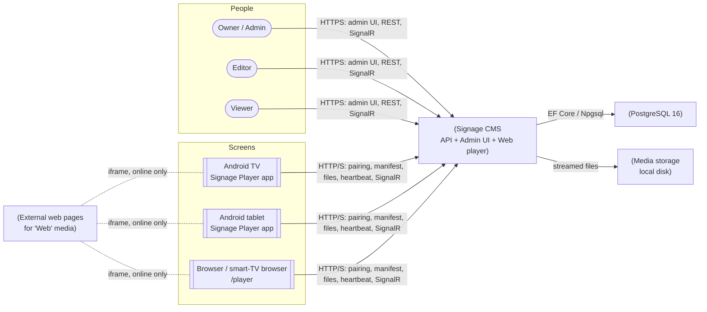
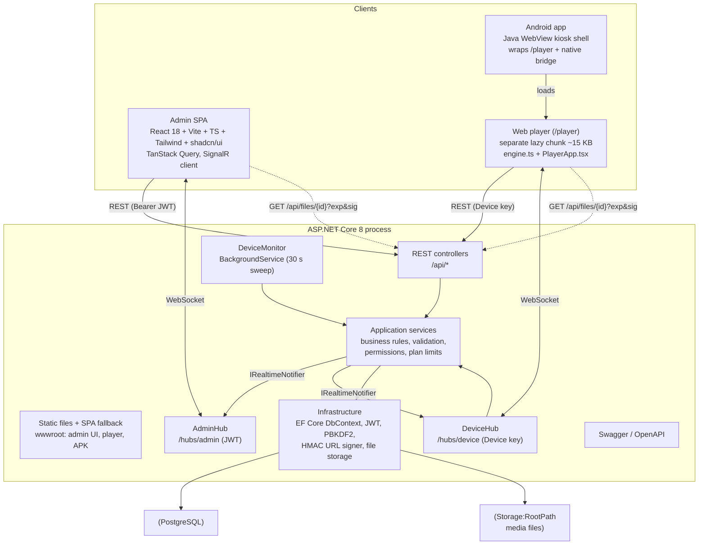
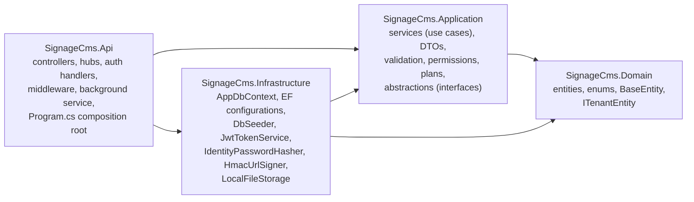
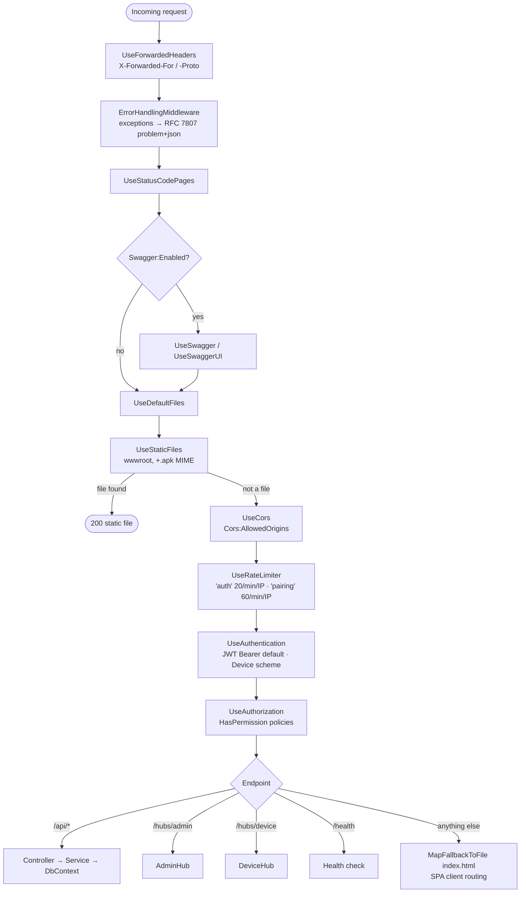
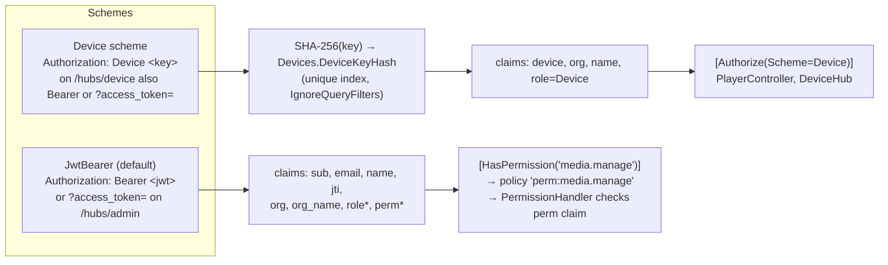
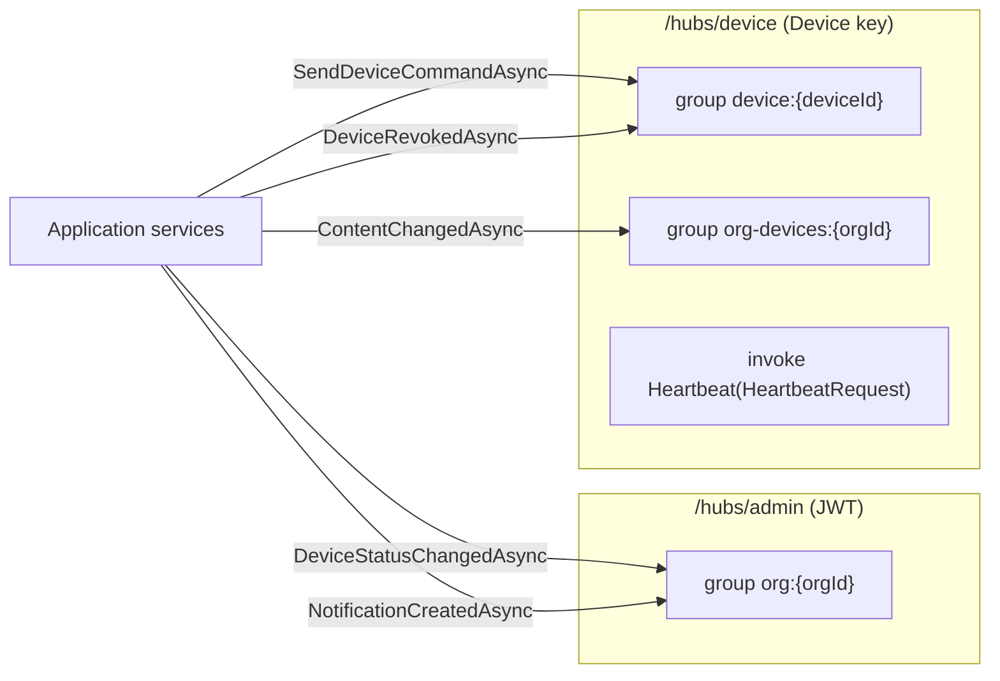
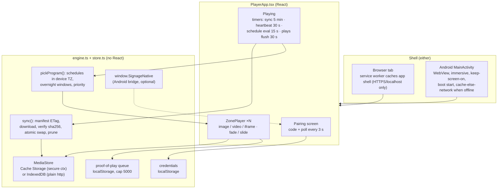
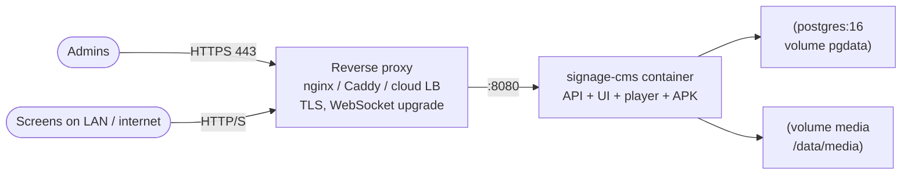
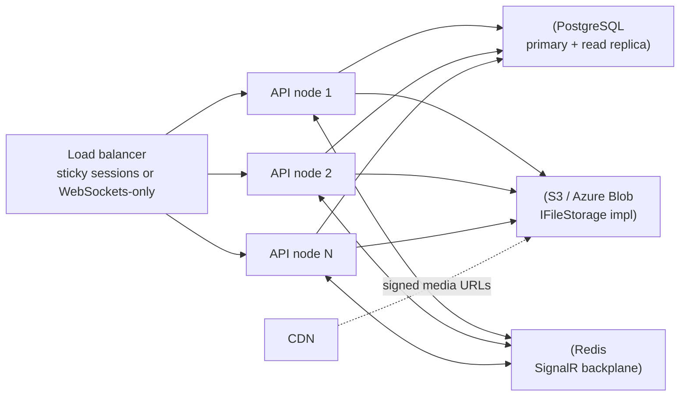

# 2. System architecture

## 2.1 Context

Who and what talks to the system.

## 2.2 High-level architecture

A single deployable ASP.NET Core process serves three front ends and two real-time hubs:

**Key properties**

| Property | How it's achieved |
|---|---|
| Multi-tenant isolation | `OrganizationId` on every tenant row, EF global query filters, and a cross-tenant write guard in `SaveChangesAsync` ([Database §3.6](03-database.md#36-multi-tenancy-enforcement)) |
| Real-time | SignalR: admin UIs join `org:{id}`; players join `device:{id}` and `org-devices:{orgId}` |
| Offline-first players | Full manifest + sha256-verified media cache + on-device schedule evaluation in the screen's time zone |
| Extensible device types | `DeviceType` stored as text; any client that implements the 5 player endpoints works ([Players §8.5](08-players.md#85-device-protocol-for-new-device-types)) |
| Stateless API (mostly) | JWTs, DB-backed state. The exceptions (single-node) are local media storage and the in-memory SignalR group and connection counts; see [§2.8](#28-deployment-topology-and-scaling) |

## 2.3 Clean architecture layers

Dependency rule: **Domain** depends on nothing. **Application** depends on Domain and on EF Core abstractions only (`IAppDbContext` exposes `DbSet<T>`). **Infrastructure** implements Application's interfaces. **Api** wires everything together and holds no business rules; every controller action is a one-line call into a service.

| Abstraction (Application) | Implementation | Layer |
|---|---|---|
| `IAppDbContext` | `AppDbContext` (EF Core + Npgsql) | Infrastructure |
| `ICurrentUser` | `HttpCurrentUser` (claims of the JWT or device principal) | Api |
| `IPasswordHasher` | `IdentityPasswordHasher` (PBKDF2, ASP.NET Identity v3) | Infrastructure |
| `ITokenService` | `JwtTokenService` (HS256) | Infrastructure |
| `IUrlSigner` | `HmacUrlSigner` (HMAC-SHA256, key derived from `Jwt:SigningKey`) | Infrastructure |
| `IFileStorage` | `LocalFileStorage` (streaming write + sha256) | Infrastructure |
| `IRealtimeNotifier` | `SignalRNotifier` | Api |
| `IClock` | `SystemClock` | Application |

## 2.4 Low-level: request pipeline

Middleware in the order registered in `Program.cs`:

## 2.5 Low-level: authentication and authorization

- Permission policies are built on demand by `PermissionPolicyProvider` and always use the JWT scheme, so a device key can never satisfy an admin endpoint and a JWT can never call the player API (both are covered by tests).
- Access tokens last 15 minutes. Refresh tokens last 14 days, are stored as SHA-256 hashes, and rotate on every use. Presenting an already-rotated refresh token revokes every active session of that user (theft detection).

## 2.6 Low-level: real-time channels

| Hub | Server → client | Payload | Client → server |
|---|---|---|---|
| AdminHub | `DeviceStatus` | `{ id, status, lastSeenAt, currentItem, syncedVersion }` | none |
| AdminHub | `Notification` | `NotificationDto` | |
| DeviceHub | `ContentChanged` | none: the player re-fetches its manifest with `If-None-Match` | `Heartbeat(HeartbeatRequest)` |
| DeviceHub | `Command` | `{ command: "identify" \| "refresh" \| "reload" \| "clear-cache", payload }` | |
| DeviceHub | `Revoked` | none: the player wipes its key and cache and returns to pairing | |

`ContentChanged` is broadcast to **all** devices in the organization. Each player answers with a conditional manifest request, and screens whose content didn't change get a `304` (a few hundred bytes). That keeps change detection in one place (the manifest hash) and avoids computing affected-device sets on every edit. At very large fleets, see [§2.8](#28-deployment-topology-and-scaling).

Presence: `DeviceHub.OnConnectedAsync` marks the device Online. `OnDisconnectedAsync` marks it Offline only when that node's per-device connection count reaches 0, so a page reload doesn't flap the status. `DeviceMonitor` marks devices Offline when `LastSeenAt` is older than 90 s (for example after a power cut with no clean disconnect).

## 2.7 Player architecture

## 2.8 Deployment topology and scaling

**Reference deployment (single node)**, which is what `docker-compose.yml` produces:

**Scaling out (multi-node): required changes**

| Concern today | Change for multi-node |
|---|---|
| `LocalFileStorage` | Implement `IFileStorage` for S3 or Azure Blob; serve media through a CDN with the same HMAC-signed URLs, or with provider pre-signed URLs |
| SignalR groups are per node | `AddSignalR().AddStackExchangeRedis(...)` |
| `DeviceHub` connection counting is in memory | Move counts to Redis, or rely on `DeviceMonitor` (90 s) as the source of truth |
| `DeviceMonitor` runs on every node | Harmless (idempotent), but add a distributed lock to avoid duplicate "Device offline" notifications |
| Data Protection keys (not used for auth today) | Persist to a shared store if cookies or antiforgery are added later |
| `EnsureCreated()` at startup | Switch to EF migrations run once by a deploy job ([Deployment §9.4](09-deployment.md#94-database-migrations)) |

## 2.9 Technology stack

| Area | Technology | Version |
|---|---|---|
| Backend runtime | .NET / ASP.NET Core | 8.0 |
| ORM / DB driver | EF Core, Npgsql.EntityFrameworkCore.PostgreSQL | 8.0.11 |
| Database | PostgreSQL | 14+ (tested 16) |
| Auth | Microsoft.AspNetCore.Authentication.JwtBearer, System.IdentityModel.Tokens.Jwt | 8.0.11, 7.1.2 |
| API docs | Swashbuckle.AspNetCore | 6.5.0 |
| Real-time | ASP.NET Core SignalR (JSON protocol) | 8.0 |
| Admin UI | React, React Router, TanStack Query, Tailwind CSS, shadcn/ui (Radix), lucide-react, sonner | 18, 6, 5, 3, n/a, n/a, 2 |
| Build | Vite, TypeScript | 5, 5.6 |
| Real-time client | @microsoft/signalr | 8 |
| Android app | Java 8 source, Android SDK platform 23, minSdk 21; built with aapt/javac/dx/apksigner | n/a |
| Tests | Node 20+ (e2e.mjs), Python 3 + Playwright (Chromium) | n/a |
