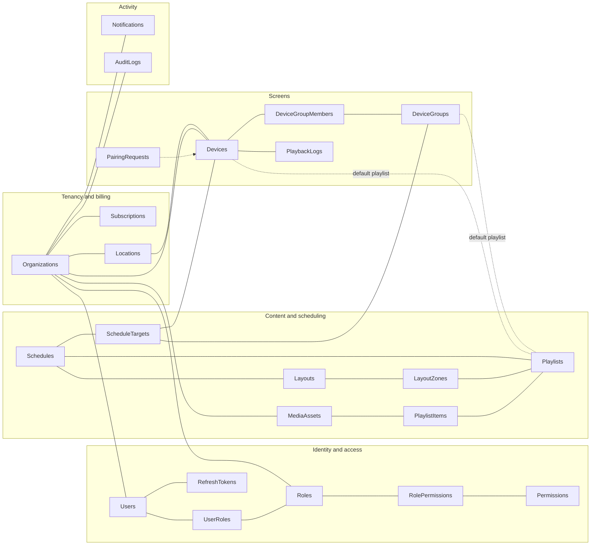
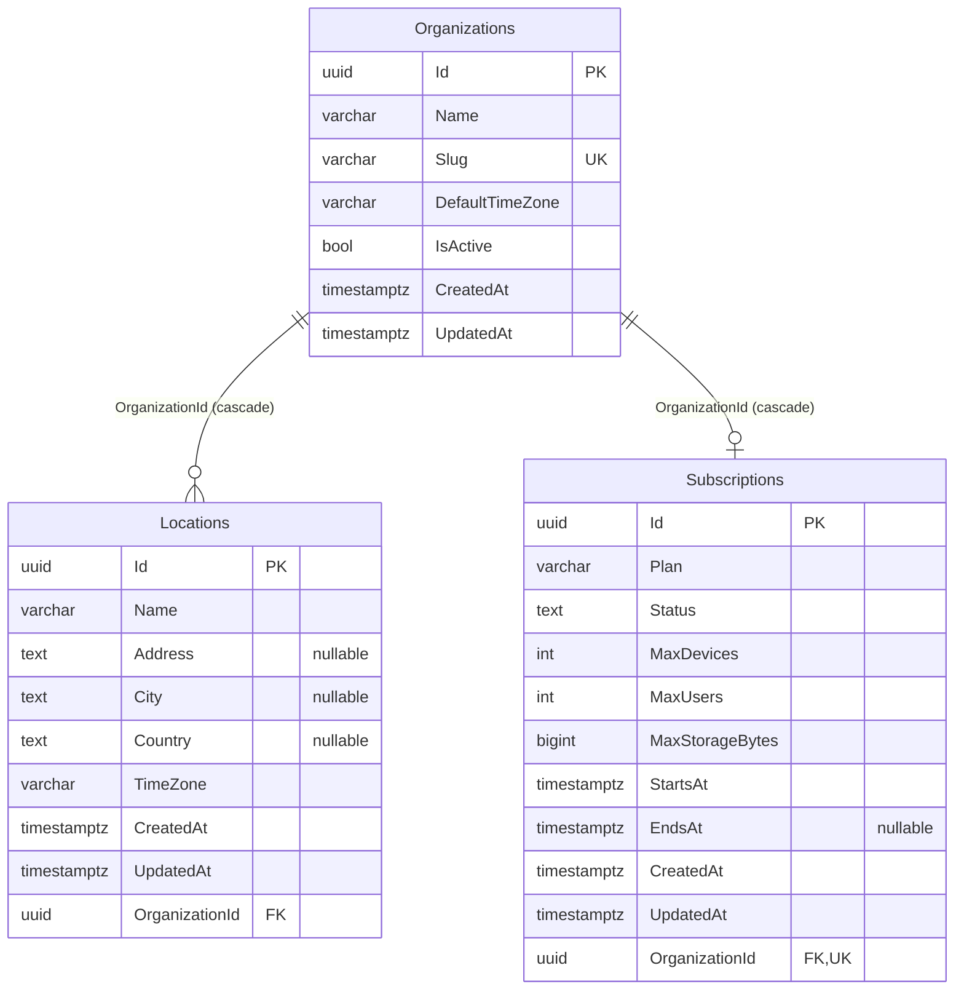
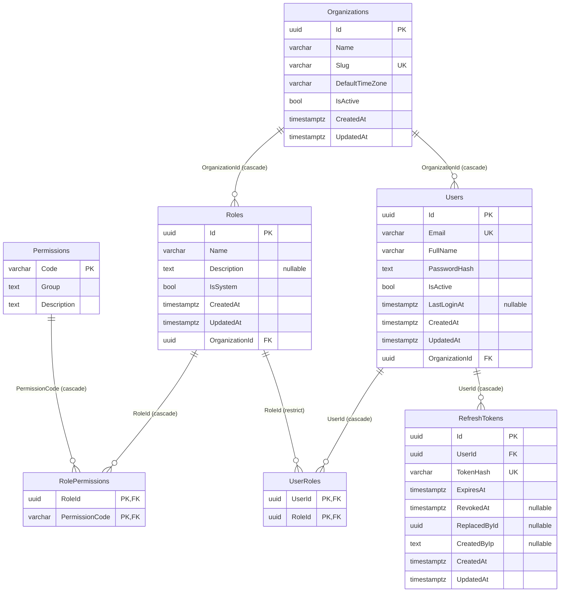
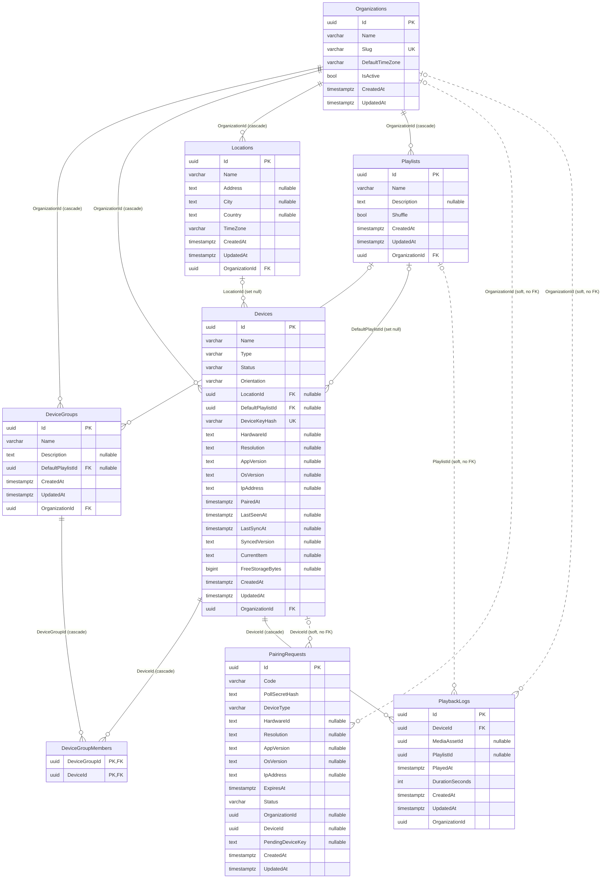
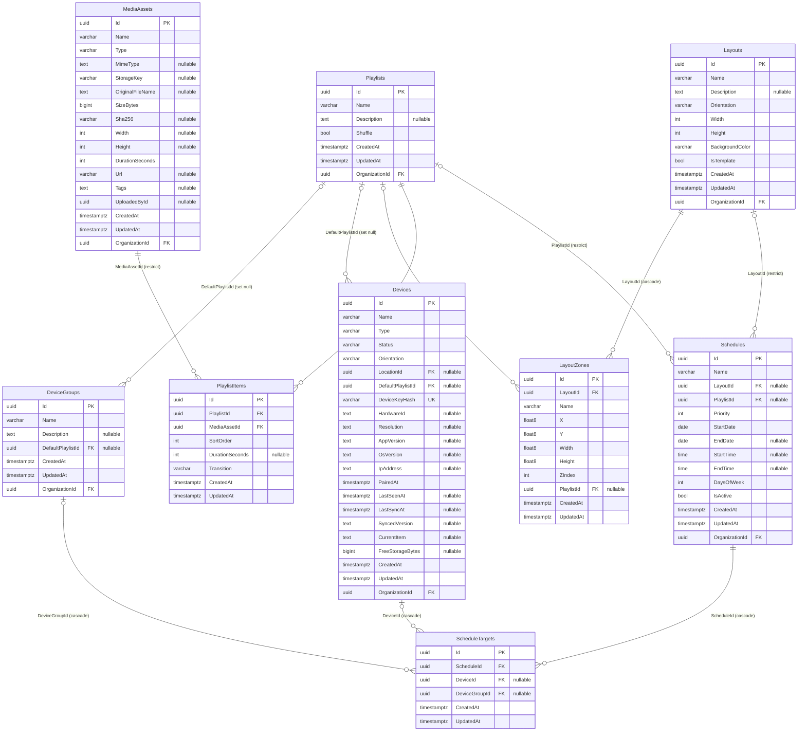
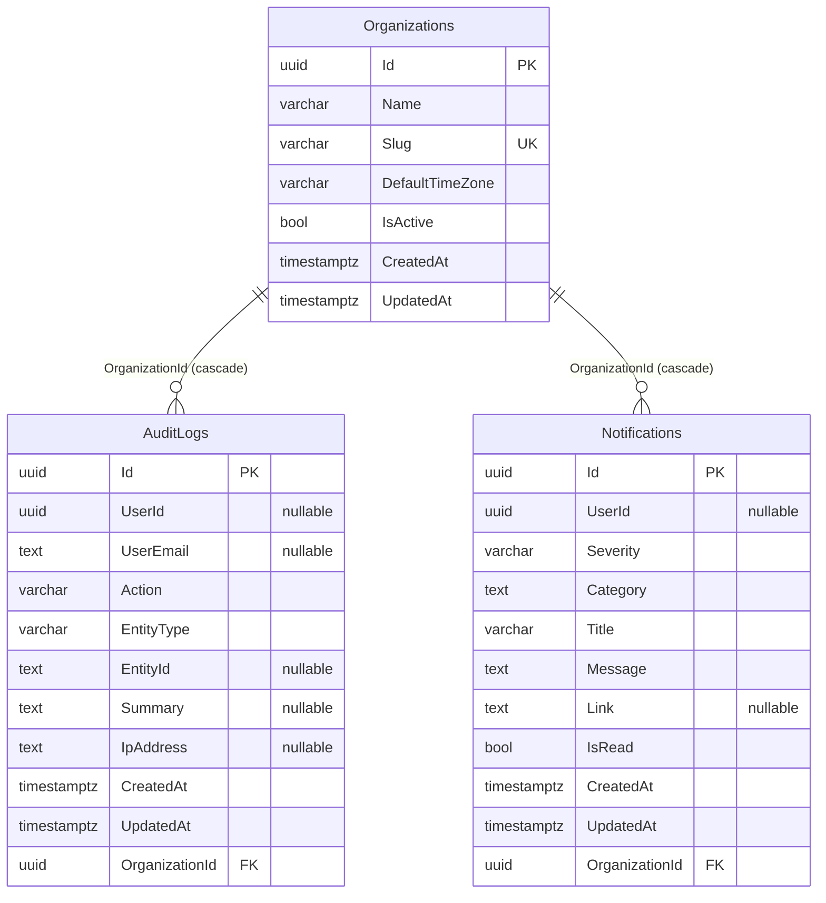
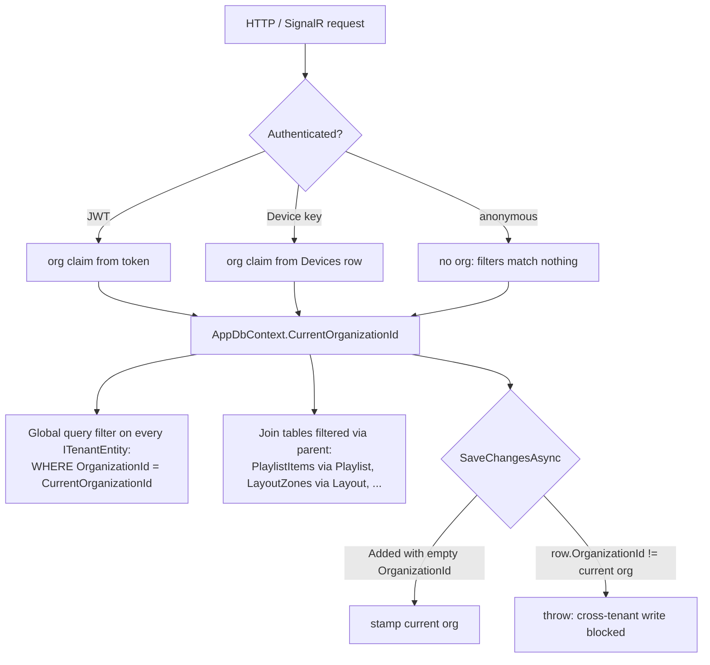

# 3. Database

> Generated from the live PostgreSQL catalog by `docs/_tools/gen_db_doc.py`. Re-run it after any schema change; don't edit this file by hand.

PostgreSQL 16 · EF Core 8 (Npgsql 8) · **23 tables**, **32 foreign keys**, **7 unique indexes**, **2 check constraints**.

## 3.1 Conventions

| Convention | Detail |
|---|---|
| Primary keys | `uuid`, generated in the application (`Guid.NewGuid()`), configured `ValueGeneratedNever`. Join tables use composite keys. `Permissions` is keyed by its code. |
| Tenancy | Every tenant-owned table has `OrganizationId` (indexed). EF global query filters add `WHERE "OrganizationId" = @currentOrg` to every query, and join tables are filtered through their parent. See [§3.6](#36-multi-tenancy-enforcement). |
| Enums | Stored as `text` (e.g. `Devices.Type = 'AndroidTv'`), so adding a device type needs no data migration. |
| Timestamps | `timestamp with time zone`, always UTC. `CreatedAt` and `UpdatedAt` are set in `AppDbContext.SaveChangesAsync`. |
| Secrets | Never stored in plain text: passwords are PBKDF2 hashes (ASP.NET Identity v3 format); refresh tokens, device keys and pairing poll secrets are SHA-256 hashes. |
| Naming | Tables are plural PascalCase. Constraint names follow EF conventions (`PK_`, `FK_<Child>_<Parent>_<Column>`, `IX_`, `CK_`). |

## 3.2 Domain overview

## 3.3 Complete ERD

Crow's-foot notation: `||` exactly one, `|o` zero or one, `o{` zero or many. Each relationship is labelled with the FK column and its `ON DELETE` rule. Dotted lines are soft references with no database FK.

For readability this map shows **key columns only** (PK, FK, UK and soft-reference columns). Every column appears in the per-domain ERDs below and in the [table reference](#34-table-reference).

```mermaid
erDiagram
    AuditLogs {
        uuid Id PK
        uuid UserId "nullable"
        uuid OrganizationId FK
    }
    DeviceGroupMembers {
        uuid DeviceGroupId PK,FK
        uuid DeviceId PK,FK
    }
    DeviceGroups {
        uuid Id PK
        uuid DefaultPlaylistId FK "nullable"
        uuid OrganizationId FK
    }
    Devices {
        uuid Id PK
        uuid LocationId FK "nullable"
        uuid DefaultPlaylistId FK "nullable"
        varchar DeviceKeyHash UK
        uuid OrganizationId FK
    }
    LayoutZones {
        uuid Id PK
        uuid LayoutId FK
        uuid PlaylistId FK "nullable"
    }
    Layouts {
        uuid Id PK
        uuid OrganizationId FK
    }
    Locations {
        uuid Id PK
        uuid OrganizationId FK
    }
    MediaAssets {
        uuid Id PK
        uuid UploadedById "nullable"
        uuid OrganizationId FK
    }
    Notifications {
        uuid Id PK
        uuid UserId "nullable"
        uuid OrganizationId FK
    }
    Organizations {
        uuid Id PK
        varchar Slug UK
    }
    PairingRequests {
        uuid Id PK
        uuid OrganizationId "nullable"
        uuid DeviceId "nullable"
    }
    Permissions {
        varchar Code PK
    }
    PlaybackLogs {
        uuid Id PK
        uuid DeviceId FK
        uuid MediaAssetId "nullable"
        uuid PlaylistId "nullable"
        uuid OrganizationId
    }
    PlaylistItems {
        uuid Id PK
        uuid PlaylistId FK
        uuid MediaAssetId FK
    }
    Playlists {
        uuid Id PK
        uuid OrganizationId FK
    }
    RefreshTokens {
        uuid Id PK
        uuid UserId FK
        varchar TokenHash UK
    }
    RolePermissions {
        uuid RoleId PK,FK
        varchar PermissionCode PK,FK
    }
    Roles {
        uuid Id PK
        uuid OrganizationId FK
    }
    ScheduleTargets {
        uuid Id PK
        uuid ScheduleId FK
        uuid DeviceId FK "nullable"
        uuid DeviceGroupId FK "nullable"
    }
    Schedules {
        uuid Id PK
        uuid LayoutId FK "nullable"
        uuid PlaylistId FK "nullable"
        uuid OrganizationId FK
    }
    Subscriptions {
        uuid Id PK
        uuid OrganizationId FK,UK
    }
    UserRoles {
        uuid UserId PK,FK
        uuid RoleId PK,FK
    }
    Users {
        uuid Id PK
        varchar Email UK
        uuid OrganizationId FK
    }
    Organizations ||--o{ AuditLogs : "OrganizationId (cascade)"
    DeviceGroups ||--o{ DeviceGroupMembers : "DeviceGroupId (cascade)"
    Devices ||--o{ DeviceGroupMembers : "DeviceId (cascade)"
    Playlists |o--o{ DeviceGroups : "DefaultPlaylistId (set null)"
    Organizations ||--o{ DeviceGroups : "OrganizationId (cascade)"
    Playlists |o--o{ Devices : "DefaultPlaylistId (set null)"
    Locations |o--o{ Devices : "LocationId (set null)"
    Organizations ||--o{ Devices : "OrganizationId (cascade)"
    Layouts ||--o{ LayoutZones : "LayoutId (cascade)"
    Playlists |o--o{ LayoutZones : "PlaylistId (set null)"
    Organizations ||--o{ Layouts : "OrganizationId (cascade)"
    Organizations ||--o{ Locations : "OrganizationId (cascade)"
    Organizations ||--o{ MediaAssets : "OrganizationId (cascade)"
    Organizations ||--o{ Notifications : "OrganizationId (cascade)"
    Devices ||--o{ PlaybackLogs : "DeviceId (cascade)"
    MediaAssets ||--o{ PlaylistItems : "MediaAssetId (restrict)"
    Playlists ||--o{ PlaylistItems : "PlaylistId (cascade)"
    Organizations ||--o{ Playlists : "OrganizationId (cascade)"
    Users ||--o{ RefreshTokens : "UserId (cascade)"
    Permissions ||--o{ RolePermissions : "PermissionCode (cascade)"
    Roles ||--o{ RolePermissions : "RoleId (cascade)"
    Organizations ||--o{ Roles : "OrganizationId (cascade)"
    DeviceGroups |o--o{ ScheduleTargets : "DeviceGroupId (cascade)"
    Devices |o--o{ ScheduleTargets : "DeviceId (cascade)"
    Schedules ||--o{ ScheduleTargets : "ScheduleId (cascade)"
    Layouts |o--o{ Schedules : "LayoutId (restrict)"
    Organizations ||--o{ Schedules : "OrganizationId (cascade)"
    Playlists |o--o{ Schedules : "PlaylistId (restrict)"
    Organizations ||--o| Subscriptions : "OrganizationId (cascade)"
    Roles ||--o{ UserRoles : "RoleId (restrict)"
    Users ||--o{ UserRoles : "UserId (cascade)"
    Organizations ||--o{ Users : "OrganizationId (cascade)"
    Organizations |o..o{ PairingRequests : "OrganizationId (soft, no FK)"
    Devices |o..o{ PairingRequests : "DeviceId (soft, no FK)"
    MediaAssets |o..o{ PlaybackLogs : "MediaAssetId (soft, no FK)"
    Playlists |o..o{ PlaybackLogs : "PlaylistId (soft, no FK)"
    Organizations |o..o{ PlaybackLogs : "OrganizationId (soft, no FK)"
    Users |o..o{ AuditLogs : "UserId (soft, no FK)"
    Users |o..o{ Notifications : "UserId (soft, no FK)"
    Users |o..o{ MediaAssets : "UploadedById (soft, no FK)"
```

### ERDs by domain

#### Tenancy and billing

#### Identity and access

#### Screens

#### Content and scheduling

#### Activity

## 3.4 Table reference

### AuditLogs

| Column | Type | Null | Key | References |
|---|---|---|---|---|
| `Id` | uuid | no | PK |  |
| `UserId` | uuid | yes |  | `Users` (soft) |
| `UserEmail` | text | yes |  |  |
| `Action` | varchar(60) | no |  |  |
| `EntityType` | varchar(60) | no |  |  |
| `EntityId` | text | yes |  |  |
| `Summary` | text | yes |  |  |
| `IpAddress` | text | yes |  |  |
| `CreatedAt` | timestamptz | no |  |  |
| `UpdatedAt` | timestamptz | no |  |  |
| `OrganizationId` | uuid | no | FK | `Organizations.Id` · on delete **CASCADE** |

- INDEX `IX_AuditLogs_OrganizationId` (OrganizationId)  
- INDEX `IX_AuditLogs_OrganizationId_CreatedAt` (OrganizationId, CreatedAt)

### DeviceGroupMembers

| Column | Type | Null | Key | References |
|---|---|---|---|---|
| `DeviceGroupId` | uuid | no | PK FK | `DeviceGroups.Id` · on delete **CASCADE** |
| `DeviceId` | uuid | no | PK FK | `Devices.Id` · on delete **CASCADE** |

- INDEX `IX_DeviceGroupMembers_DeviceId` (DeviceId)

### DeviceGroups

| Column | Type | Null | Key | References |
|---|---|---|---|---|
| `Id` | uuid | no | PK |  |
| `Name` | varchar(120) | no |  |  |
| `Description` | text | yes |  |  |
| `DefaultPlaylistId` | uuid | yes | FK | `Playlists.Id` · on delete **SET NULL** |
| `CreatedAt` | timestamptz | no |  |  |
| `UpdatedAt` | timestamptz | no |  |  |
| `OrganizationId` | uuid | no | FK | `Organizations.Id` · on delete **CASCADE** |

- UNIQUE `IX_DeviceGroups_OrganizationId_Name` (OrganizationId, Name)  
- INDEX `IX_DeviceGroups_DefaultPlaylistId` (DefaultPlaylistId)  
- INDEX `IX_DeviceGroups_OrganizationId` (OrganizationId)

### Devices

| Column | Type | Null | Key | References |
|---|---|---|---|---|
| `Id` | uuid | no | PK |  |
| `Name` | varchar(120) | no |  |  |
| `Type` | varchar(30) | no |  |  |
| `Status` | varchar(20) | no |  |  |
| `Orientation` | varchar(20) | no |  |  |
| `LocationId` | uuid | yes | FK | `Locations.Id` · on delete **SET NULL** |
| `DefaultPlaylistId` | uuid | yes | FK | `Playlists.Id` · on delete **SET NULL** |
| `DeviceKeyHash` | varchar(64) | no | UNIQUE |  |
| `HardwareId` | text | yes |  |  |
| `Resolution` | text | yes |  |  |
| `AppVersion` | text | yes |  |  |
| `OsVersion` | text | yes |  |  |
| `IpAddress` | text | yes |  |  |
| `PairedAt` | timestamptz | no |  |  |
| `LastSeenAt` | timestamptz | yes |  |  |
| `LastSyncAt` | timestamptz | yes |  |  |
| `SyncedVersion` | text | yes |  |  |
| `CurrentItem` | text | yes |  |  |
| `FreeStorageBytes` | bigint | yes |  |  |
| `CreatedAt` | timestamptz | no |  |  |
| `UpdatedAt` | timestamptz | no |  |  |
| `OrganizationId` | uuid | no | FK | `Organizations.Id` · on delete **CASCADE** |

- UNIQUE `IX_Devices_DeviceKeyHash` (DeviceKeyHash)  
- INDEX `IX_Devices_DefaultPlaylistId` (DefaultPlaylistId)  
- INDEX `IX_Devices_LocationId` (LocationId)  
- INDEX `IX_Devices_OrganizationId` (OrganizationId)  
- INDEX `IX_Devices_Status_LastSeenAt` (Status, LastSeenAt)

### LayoutZones

| Column | Type | Null | Key | References |
|---|---|---|---|---|
| `Id` | uuid | no | PK |  |
| `LayoutId` | uuid | no | FK | `Layouts.Id` · on delete **CASCADE** |
| `Name` | varchar(60) | no |  |  |
| `X` | float8 | no |  |  |
| `Y` | float8 | no |  |  |
| `Width` | float8 | no |  |  |
| `Height` | float8 | no |  |  |
| `ZIndex` | int | no |  |  |
| `PlaylistId` | uuid | yes | FK | `Playlists.Id` · on delete **SET NULL** |
| `CreatedAt` | timestamptz | no |  |  |
| `UpdatedAt` | timestamptz | no |  |  |

- INDEX `IX_LayoutZones_LayoutId` (LayoutId)  
- INDEX `IX_LayoutZones_PlaylistId` (PlaylistId)

### Layouts

| Column | Type | Null | Key | References |
|---|---|---|---|---|
| `Id` | uuid | no | PK |  |
| `Name` | varchar(120) | no |  |  |
| `Description` | text | yes |  |  |
| `Orientation` | varchar(20) | no |  |  |
| `Width` | int | no |  |  |
| `Height` | int | no |  |  |
| `BackgroundColor` | varchar(7) | no |  |  |
| `IsTemplate` | bool | no |  |  |
| `CreatedAt` | timestamptz | no |  |  |
| `UpdatedAt` | timestamptz | no |  |  |
| `OrganizationId` | uuid | no | FK | `Organizations.Id` · on delete **CASCADE** |

- INDEX `IX_Layouts_OrganizationId` (OrganizationId)

### Locations

| Column | Type | Null | Key | References |
|---|---|---|---|---|
| `Id` | uuid | no | PK |  |
| `Name` | varchar(120) | no |  |  |
| `Address` | text | yes |  |  |
| `City` | text | yes |  |  |
| `Country` | text | yes |  |  |
| `TimeZone` | varchar(64) | no |  |  |
| `CreatedAt` | timestamptz | no |  |  |
| `UpdatedAt` | timestamptz | no |  |  |
| `OrganizationId` | uuid | no | FK | `Organizations.Id` · on delete **CASCADE** |

- INDEX `IX_Locations_OrganizationId` (OrganizationId)

### MediaAssets

| Column | Type | Null | Key | References |
|---|---|---|---|---|
| `Id` | uuid | no | PK |  |
| `Name` | varchar(200) | no |  |  |
| `Type` | varchar(20) | no |  |  |
| `MimeType` | text | yes |  |  |
| `StorageKey` | varchar(300) | yes |  |  |
| `OriginalFileName` | text | yes |  |  |
| `SizeBytes` | bigint | no |  |  |
| `Sha256` | varchar(64) | yes |  |  |
| `Width` | int | yes |  |  |
| `Height` | int | yes |  |  |
| `DurationSeconds` | int | no |  |  |
| `Url` | varchar(2000) | yes |  |  |
| `Tags` | text | yes |  |  |
| `UploadedById` | uuid | yes |  | `Users` (soft) |
| `CreatedAt` | timestamptz | no |  |  |
| `UpdatedAt` | timestamptz | no |  |  |
| `OrganizationId` | uuid | no | FK | `Organizations.Id` · on delete **CASCADE** |

- INDEX `IX_MediaAssets_OrganizationId` (OrganizationId)

### Notifications

| Column | Type | Null | Key | References |
|---|---|---|---|---|
| `Id` | uuid | no | PK |  |
| `UserId` | uuid | yes |  | `Users` (soft) |
| `Severity` | varchar(20) | no |  |  |
| `Category` | text | no |  |  |
| `Title` | varchar(200) | no |  |  |
| `Message` | text | no |  |  |
| `Link` | text | yes |  |  |
| `IsRead` | bool | no |  |  |
| `CreatedAt` | timestamptz | no |  |  |
| `UpdatedAt` | timestamptz | no |  |  |
| `OrganizationId` | uuid | no | FK | `Organizations.Id` · on delete **CASCADE** |

- INDEX `IX_Notifications_OrganizationId` (OrganizationId)  
- INDEX `IX_Notifications_OrganizationId_IsRead_CreatedAt` (OrganizationId, IsRead, CreatedAt)

### Organizations

| Column | Type | Null | Key | References |
|---|---|---|---|---|
| `Id` | uuid | no | PK |  |
| `Name` | varchar(120) | no |  |  |
| `Slug` | varchar(60) | no | UNIQUE |  |
| `DefaultTimeZone` | varchar(64) | no |  |  |
| `IsActive` | bool | no |  |  |
| `CreatedAt` | timestamptz | no |  |  |
| `UpdatedAt` | timestamptz | no |  |  |

- UNIQUE `IX_Organizations_Slug` (Slug)

### PairingRequests

| Column | Type | Null | Key | References |
|---|---|---|---|---|
| `Id` | uuid | no | PK |  |
| `Code` | varchar(12) | no |  |  |
| `PollSecretHash` | text | no |  |  |
| `DeviceType` | varchar(30) | no |  |  |
| `HardwareId` | text | yes |  |  |
| `Resolution` | text | yes |  |  |
| `AppVersion` | text | yes |  |  |
| `OsVersion` | text | yes |  |  |
| `IpAddress` | text | yes |  |  |
| `ExpiresAt` | timestamptz | no |  |  |
| `Status` | varchar(20) | no |  |  |
| `OrganizationId` | uuid | yes |  | `Organizations` (soft) |
| `DeviceId` | uuid | yes |  | `Devices` (soft) |
| `PendingDeviceKey` | text | yes |  |  |
| `CreatedAt` | timestamptz | no |  |  |
| `UpdatedAt` | timestamptz | no |  |  |

- INDEX `IX_PairingRequests_Code_Status` (Code, Status)

### Permissions

| Column | Type | Null | Key | References |
|---|---|---|---|---|
| `Code` | varchar(60) | no | PK |  |
| `Group` | text | no |  |  |
| `Description` | text | no |  |  |

### PlaybackLogs

| Column | Type | Null | Key | References |
|---|---|---|---|---|
| `Id` | uuid | no | PK |  |
| `DeviceId` | uuid | no | FK | `Devices.Id` · on delete **CASCADE** |
| `MediaAssetId` | uuid | yes |  | `MediaAssets` (soft) |
| `PlaylistId` | uuid | yes |  | `Playlists` (soft) |
| `PlayedAt` | timestamptz | no |  |  |
| `DurationSeconds` | int | no |  |  |
| `CreatedAt` | timestamptz | no |  |  |
| `UpdatedAt` | timestamptz | no |  |  |
| `OrganizationId` | uuid | no |  | `Organizations` (soft) |

- INDEX `IX_PlaybackLogs_DeviceId_PlayedAt` (DeviceId, PlayedAt)  
- INDEX `IX_PlaybackLogs_OrganizationId` (OrganizationId)

### PlaylistItems

| Column | Type | Null | Key | References |
|---|---|---|---|---|
| `Id` | uuid | no | PK |  |
| `PlaylistId` | uuid | no | FK | `Playlists.Id` · on delete **CASCADE** |
| `MediaAssetId` | uuid | no | FK | `MediaAssets.Id` · on delete **RESTRICT** |
| `SortOrder` | int | no |  |  |
| `DurationSeconds` | int | yes |  |  |
| `Transition` | varchar(20) | no |  |  |
| `CreatedAt` | timestamptz | no |  |  |
| `UpdatedAt` | timestamptz | no |  |  |

- INDEX `IX_PlaylistItems_MediaAssetId` (MediaAssetId)  
- INDEX `IX_PlaylistItems_PlaylistId_SortOrder` (PlaylistId, SortOrder)

### Playlists

| Column | Type | Null | Key | References |
|---|---|---|---|---|
| `Id` | uuid | no | PK |  |
| `Name` | varchar(120) | no |  |  |
| `Description` | text | yes |  |  |
| `Shuffle` | bool | no |  |  |
| `CreatedAt` | timestamptz | no |  |  |
| `UpdatedAt` | timestamptz | no |  |  |
| `OrganizationId` | uuid | no | FK | `Organizations.Id` · on delete **CASCADE** |

- INDEX `IX_Playlists_OrganizationId` (OrganizationId)

### RefreshTokens

| Column | Type | Null | Key | References |
|---|---|---|---|---|
| `Id` | uuid | no | PK |  |
| `UserId` | uuid | no | FK | `Users.Id` · on delete **CASCADE** |
| `TokenHash` | varchar(64) | no | UNIQUE |  |
| `ExpiresAt` | timestamptz | no |  |  |
| `RevokedAt` | timestamptz | yes |  |  |
| `ReplacedById` | uuid | yes |  |  |
| `CreatedByIp` | text | yes |  |  |
| `CreatedAt` | timestamptz | no |  |  |
| `UpdatedAt` | timestamptz | no |  |  |

- UNIQUE `IX_RefreshTokens_TokenHash` (TokenHash)  
- INDEX `IX_RefreshTokens_UserId` (UserId)

### RolePermissions

| Column | Type | Null | Key | References |
|---|---|---|---|---|
| `RoleId` | uuid | no | PK FK | `Roles.Id` · on delete **CASCADE** |
| `PermissionCode` | varchar(60) | no | PK FK | `Permissions.Code` · on delete **CASCADE** |

- INDEX `IX_RolePermissions_PermissionCode` (PermissionCode)

### Roles

| Column | Type | Null | Key | References |
|---|---|---|---|---|
| `Id` | uuid | no | PK |  |
| `Name` | varchar(60) | no |  |  |
| `Description` | text | yes |  |  |
| `IsSystem` | bool | no |  |  |
| `CreatedAt` | timestamptz | no |  |  |
| `UpdatedAt` | timestamptz | no |  |  |
| `OrganizationId` | uuid | no | FK | `Organizations.Id` · on delete **CASCADE** |

- UNIQUE `IX_Roles_OrganizationId_Name` (OrganizationId, Name)  
- INDEX `IX_Roles_OrganizationId` (OrganizationId)

### ScheduleTargets

| Column | Type | Null | Key | References |
|---|---|---|---|---|
| `Id` | uuid | no | PK |  |
| `ScheduleId` | uuid | no | FK | `Schedules.Id` · on delete **CASCADE** |
| `DeviceId` | uuid | yes | FK | `Devices.Id` · on delete **CASCADE** |
| `DeviceGroupId` | uuid | yes | FK | `DeviceGroups.Id` · on delete **CASCADE** |
| `CreatedAt` | timestamptz | no |  |  |
| `UpdatedAt` | timestamptz | no |  |  |

- INDEX `IX_ScheduleTargets_DeviceGroupId` (DeviceGroupId)  
- INDEX `IX_ScheduleTargets_DeviceId` (DeviceId)  
- INDEX `IX_ScheduleTargets_ScheduleId` (ScheduleId)  
- CHECK `CK_ScheduleTarget_One`: `CHECK ((("DeviceId" IS NULL) <> ("DeviceGroupId" IS NULL)))`

### Schedules

| Column | Type | Null | Key | References |
|---|---|---|---|---|
| `Id` | uuid | no | PK |  |
| `Name` | varchar(120) | no |  |  |
| `LayoutId` | uuid | yes | FK | `Layouts.Id` · on delete **RESTRICT** |
| `PlaylistId` | uuid | yes | FK | `Playlists.Id` · on delete **RESTRICT** |
| `Priority` | int | no |  |  |
| `StartDate` | date | no |  |  |
| `EndDate` | date | yes |  |  |
| `StartTime` | time | yes |  |  |
| `EndTime` | time | yes |  |  |
| `DaysOfWeek` | int | no |  |  |
| `IsActive` | bool | no |  |  |
| `CreatedAt` | timestamptz | no |  |  |
| `UpdatedAt` | timestamptz | no |  |  |
| `OrganizationId` | uuid | no | FK | `Organizations.Id` · on delete **CASCADE** |

- INDEX `IX_Schedules_LayoutId` (LayoutId)  
- INDEX `IX_Schedules_OrganizationId` (OrganizationId)  
- INDEX `IX_Schedules_PlaylistId` (PlaylistId)  
- CHECK `CK_Schedule_Content`: `CHECK ((("LayoutId" IS NULL) <> ("PlaylistId" IS NULL)))`

### Subscriptions

| Column | Type | Null | Key | References |
|---|---|---|---|---|
| `Id` | uuid | no | PK |  |
| `Plan` | varchar(20) | no |  |  |
| `Status` | text | no |  |  |
| `MaxDevices` | int | no |  |  |
| `MaxUsers` | int | no |  |  |
| `MaxStorageBytes` | bigint | no |  |  |
| `StartsAt` | timestamptz | no |  |  |
| `EndsAt` | timestamptz | yes |  |  |
| `CreatedAt` | timestamptz | no |  |  |
| `UpdatedAt` | timestamptz | no |  |  |
| `OrganizationId` | uuid | no | FK UNIQUE | `Organizations.Id` · on delete **CASCADE** |

- UNIQUE `IX_Subscriptions_OrganizationId` (OrganizationId)

### UserRoles

| Column | Type | Null | Key | References |
|---|---|---|---|---|
| `UserId` | uuid | no | PK FK | `Users.Id` · on delete **CASCADE** |
| `RoleId` | uuid | no | PK FK | `Roles.Id` · on delete **RESTRICT** |

- INDEX `IX_UserRoles_RoleId` (RoleId)

### Users

| Column | Type | Null | Key | References |
|---|---|---|---|---|
| `Id` | uuid | no | PK |  |
| `Email` | varchar(200) | no | UNIQUE |  |
| `FullName` | varchar(120) | no |  |  |
| `PasswordHash` | text | no |  |  |
| `IsActive` | bool | no |  |  |
| `LastLoginAt` | timestamptz | yes |  |  |
| `CreatedAt` | timestamptz | no |  |  |
| `UpdatedAt` | timestamptz | no |  |  |
| `OrganizationId` | uuid | no | FK | `Organizations.Id` · on delete **CASCADE** |

- UNIQUE `IX_Users_Email` (Email)  
- INDEX `IX_Users_OrganizationId` (OrganizationId)

## 3.5 Constraints and delete behaviour

| Child.column | Parent | On delete | Why |
|---|---|---|---|
| `AuditLogs.OrganizationId` | `Organizations` | CASCADE | Owned data goes with its parent. |
| `DeviceGroupMembers.DeviceGroupId` | `DeviceGroups` | CASCADE | Owned data goes with its parent. |
| `DeviceGroupMembers.DeviceId` | `Devices` | CASCADE | Owned data goes with its parent. |
| `DeviceGroups.DefaultPlaylistId` | `Playlists` | SET NULL | Optional link; the child survives. |
| `DeviceGroups.OrganizationId` | `Organizations` | CASCADE | Owned data goes with its parent. |
| `Devices.DefaultPlaylistId` | `Playlists` | SET NULL | Optional link; the child survives. |
| `Devices.LocationId` | `Locations` | SET NULL | Optional link; the child survives. |
| `Devices.OrganizationId` | `Organizations` | CASCADE | Owned data goes with its parent. |
| `LayoutZones.LayoutId` | `Layouts` | CASCADE | Owned data goes with its parent. |
| `LayoutZones.PlaylistId` | `Playlists` | SET NULL | Optional link; the child survives. |
| `Layouts.OrganizationId` | `Organizations` | CASCADE | Owned data goes with its parent. |
| `Locations.OrganizationId` | `Organizations` | CASCADE | Owned data goes with its parent. |
| `MediaAssets.OrganizationId` | `Organizations` | CASCADE | Owned data goes with its parent. |
| `Notifications.OrganizationId` | `Organizations` | CASCADE | Owned data goes with its parent. |
| `PlaybackLogs.DeviceId` | `Devices` | CASCADE | Owned data goes with its parent. |
| `PlaylistItems.MediaAssetId` | `MediaAssets` | RESTRICT | Blocked in the database; the service returns 409 first with a readable message. |
| `PlaylistItems.PlaylistId` | `Playlists` | CASCADE | Owned data goes with its parent. |
| `Playlists.OrganizationId` | `Organizations` | CASCADE | Owned data goes with its parent. |
| `RefreshTokens.UserId` | `Users` | CASCADE | Owned data goes with its parent. |
| `RolePermissions.PermissionCode` | `Permissions` | CASCADE | Owned data goes with its parent. |
| `RolePermissions.RoleId` | `Roles` | CASCADE | Owned data goes with its parent. |
| `Roles.OrganizationId` | `Organizations` | CASCADE | Owned data goes with its parent. |
| `ScheduleTargets.DeviceGroupId` | `DeviceGroups` | CASCADE | Owned data goes with its parent. |
| `ScheduleTargets.DeviceId` | `Devices` | CASCADE | Owned data goes with its parent. |
| `ScheduleTargets.ScheduleId` | `Schedules` | CASCADE | Owned data goes with its parent. |
| `Schedules.LayoutId` | `Layouts` | RESTRICT | Blocked in the database; the service returns 409 first with a readable message. |
| `Schedules.OrganizationId` | `Organizations` | CASCADE | Owned data goes with its parent. |
| `Schedules.PlaylistId` | `Playlists` | RESTRICT | Blocked in the database; the service returns 409 first with a readable message. |
| `Subscriptions.OrganizationId` | `Organizations` | CASCADE | Owned data goes with its parent. |
| `UserRoles.RoleId` | `Roles` | RESTRICT | Blocked in the database; the service returns 409 first with a readable message. |
| `UserRoles.UserId` | `Users` | CASCADE | Owned data goes with its parent. |
| `Users.OrganizationId` | `Organizations` | CASCADE | Owned data goes with its parent. |

**Check constraints**

- `Schedules.CK_Schedule_Content`: `CHECK ((("LayoutId" IS NULL) <> ("PlaylistId" IS NULL)))`
- `ScheduleTargets.CK_ScheduleTarget_One`: `CHECK ((("DeviceId" IS NULL) <> ("DeviceGroupId" IS NULL)))`

Application-level invariants (enforced in services, returned as 400/402/409):
- A schedule targets at least one device or group; exactly one of layout or playlist (also a DB check); `DaysOfWeek` is a bitmask 1..127 (bit 0 = Sunday); `Priority` is 0..100; `StartTime`/`EndTime` are both set or both null and never equal (start > end means an overnight window).
- Layout zones: 1–12 per layout, each inside 0–100 % of the canvas; resolution 320×240 to 7680×7680.
- Playlists hold at most 500 items; item durations are 1 s to 24 h; transitions are `none`, `fade` or `slide`.
- Plan limits (`Subscriptions.MaxDevices / MaxUsers / MaxStorageBytes`) are checked before pairing, adding users and uploading (HTTP 402).
- An organization always keeps at least one active Owner; built-in roles (`IsSystem`) and templates (`IsTemplate`) are read-only.
- Pairing codes are unique among `Pending` requests, valid for 15 minutes, and use the alphabet `ABCDEFGHJKLMNPQRSTUVWXYZ23456789` (no 0/O/1/I).

## 3.6 Multi-tenancy enforcement

Only these code paths use `IgnoreQueryFilters()`, each intentionally: login and registration (email lookup across tenants), refresh-token lookup, device-key authentication, signed file download (the HMAC signature is the authorization), and the background offline sweep across all tenants.

## 3.7 Enumerations (stored as text)

| Enum | Values | Columns |
|---|---|---|
| DeviceType | `AndroidTv`, `AndroidTablet`, `WebPlayer`, `Other` | `Devices.Type`, `PairingRequests.DeviceType` |
| DeviceStatus | `Offline`, `Online` | `Devices.Status` |
| Orientation | `Landscape`, `Portrait` | `Devices.Orientation`, `Layouts.Orientation` |
| MediaType | `Image`, `Video`, `Web` | `MediaAssets.Type` |
| PairingStatus | `Pending`, `Paired`, `Expired` | `PairingRequests.Status` |
| SubscriptionPlan | `Free` (3 devices / 3 users / 2 GB), `Pro` (100 / 25 / 100 GB), `Enterprise` (10 000 / 1 000 / 2 000 GB) | `Subscriptions.Plan` |
| SubscriptionStatus | `Active`, `PastDue`, `Cancelled` | `Subscriptions.Status` |
| NotificationSeverity | `Info`, `Success`, `Warning`, `Error` | `Notifications.Severity` |

## 3.8 Soft references

These columns point at other rows but deliberately have **no** foreign key, because the record must outlive its target or exists before the target does:

| Column | Points to | Reason |
|---|---|---|
| `PairingRequests.OrganizationId` | `Organizations` | Set only when claimed; a request exists before any organization is known. |
| `PairingRequests.DeviceId` | `Devices` | Set when claimed; the pairing record is kept as history after the device is removed. |
| `PlaybackLogs.MediaAssetId` | `MediaAssets` | Proof-of-play must survive media deletion (reported as “(deleted)”). |
| `PlaybackLogs.PlaylistId` | `Playlists` | Same as above. |
| `PlaybackLogs.OrganizationId` | `Organizations` | Denormalised for tenant filtering and reporting; the device FK cascades. |
| `AuditLogs.UserId` | `Users` | The audit trail must survive user deletion; `UserEmail` is copied onto the row. |
| `Notifications.UserId` | `Users` | Null means organization-wide. |
| `MediaAssets.UploadedById` | `Users` | Media survives its uploader. |

## 3.9 Data growth and retention

| Table | Growth | Recommendation |
|---|---|---|
| `PlaybackLogs` | one row per item played per screen (~8,640 per screen per day with 10 s items) | Partition by month, or roll up into daily aggregates and delete raw rows after 90 days. |
| `AuditLogs` | one row per admin change | Keep 1–7 years depending on compliance needs; index `(OrganizationId, CreatedAt)` already exists. |
| `Notifications` | device on/offline events | Delete read notifications older than 30 days. |
| `RefreshTokens` | one per sign-in or refresh | Delete rows where `ExpiresAt < now() - 1 day`. |
| `PairingRequests` | one per code shown | Delete non-pending rows older than 7 days. |

No retention jobs exist yet; see [Deployment §9.8](09-deployment.md#98-operations) for SQL you can schedule.
