# 4. Workflows

Each workflow has a **flowchart** showing decisions and error paths, and a **sequence diagram** showing which components call which. Status codes are the real ones the API returns. The complete journey from admin login to pixels on a screen is in [13-end-to-end-flow.md](13-end-to-end-flow.md).

## 4.1 User registration (new organization)

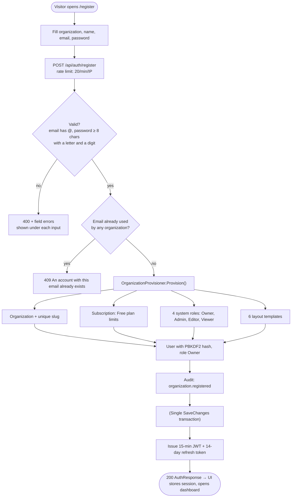

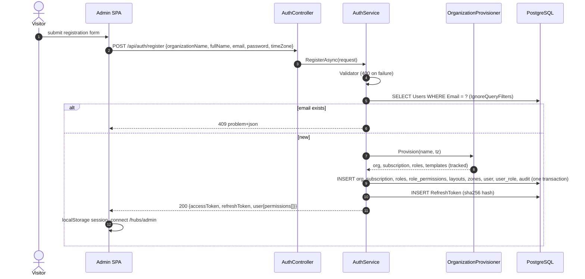

## 4.2 Organization settings and location creation

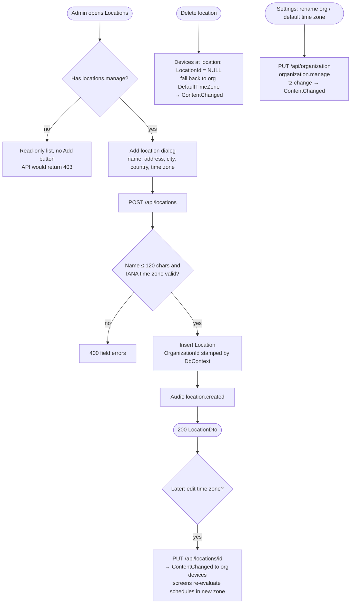

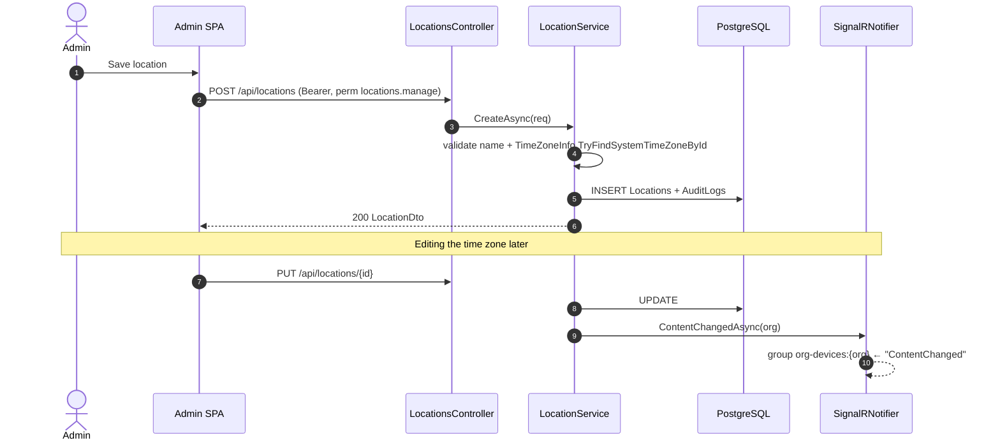

## 4.3 Device registration and pairing

Pairing never requires typing credentials on a TV remote. The screen shows a short code, an admin enters it in the CMS, and the screen then collects a long random device key exactly once.

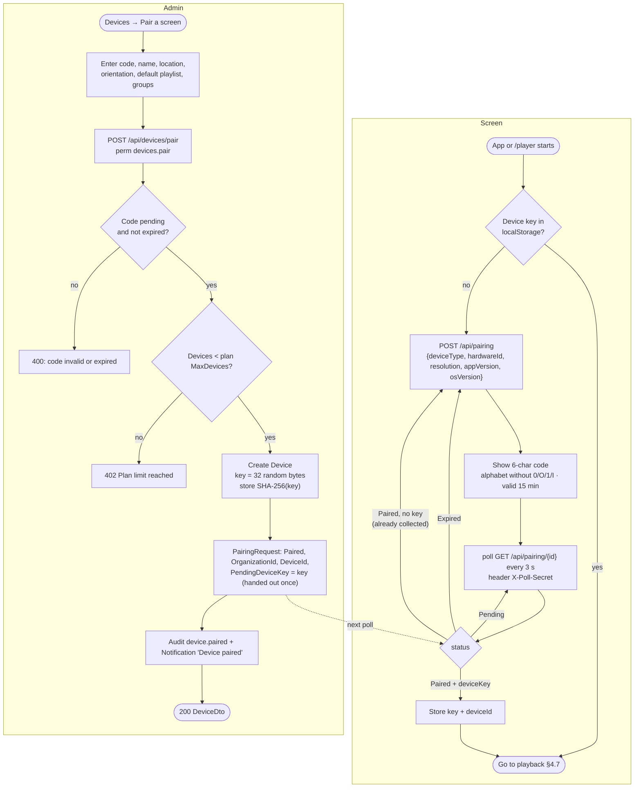

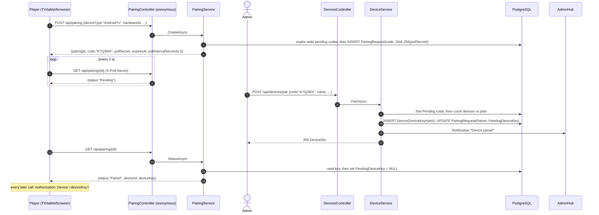

**Unpairing** (`DELETE /api/devices/{id}`) deletes the device row, which makes the key invalid immediately (401), and pushes `Revoked` over SignalR. The player wipes its key, manifest, media cache and play queue, and shows a new pairing code.

## 4.4 Media upload

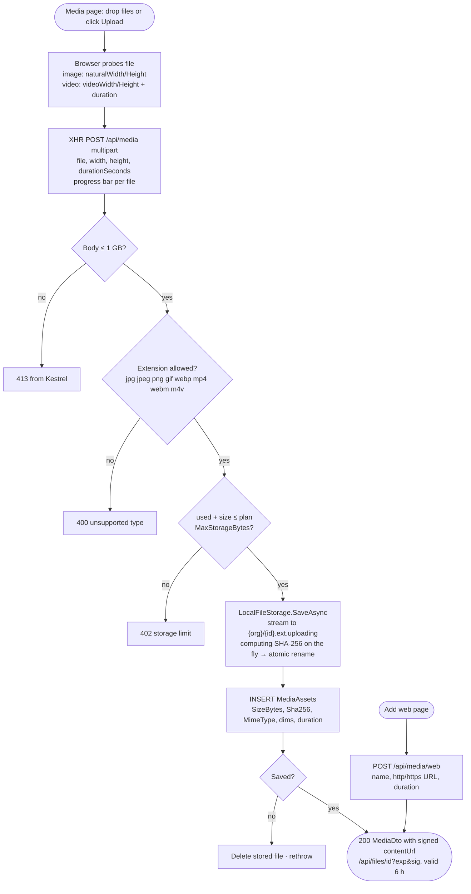

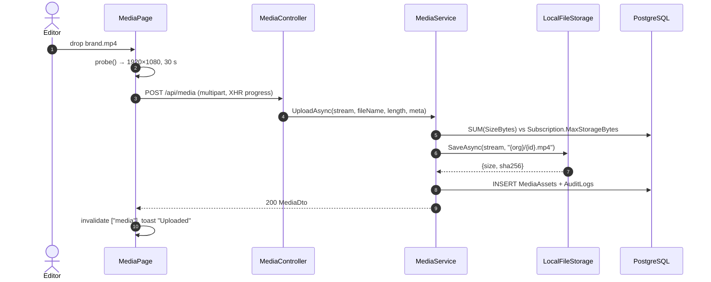

Deleting media that any playlist uses returns **409** and names the playlists. The file is removed from disk only after the database row is gone.

## 4.5 Playlist creation

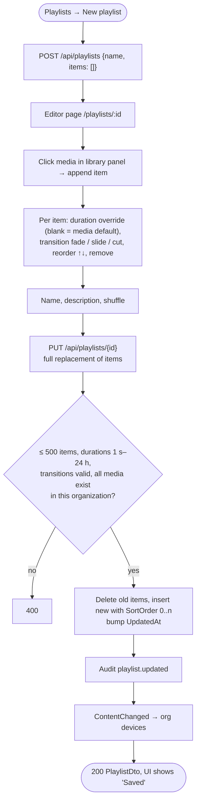

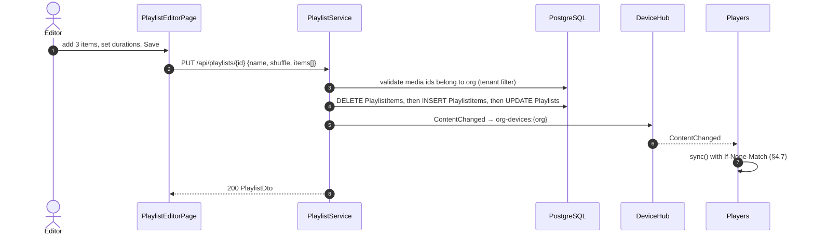

## 4.6 Scheduling

### Creating a schedule

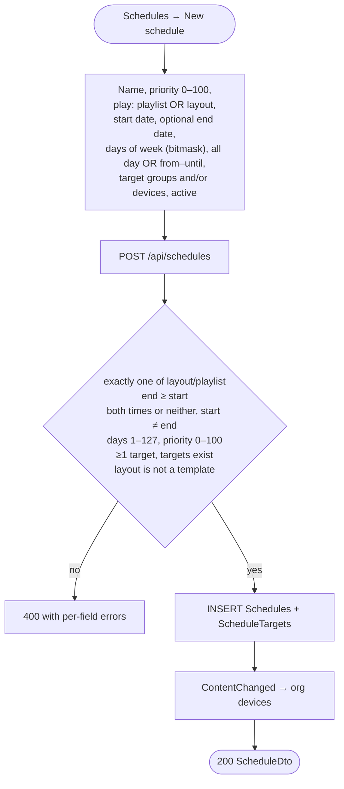

### Schedule evaluation on the screen

Schedules are evaluated **on the device**, in the device's time zone (the location's, or else the organization default), every 15 s. The server never tells a screen what to play right now, which is why screens keep switching content correctly with no network.

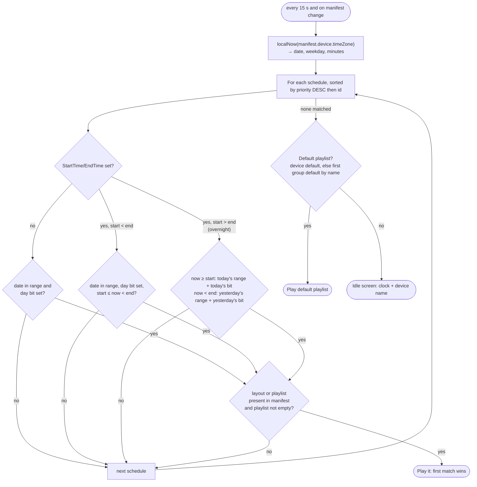

Bitmask for `DaysOfWeek`: bit 0 = Sunday … bit 6 = Saturday. Common values: `127` every day, `62` weekdays, `65` weekends.

## 4.7 Content synchronization

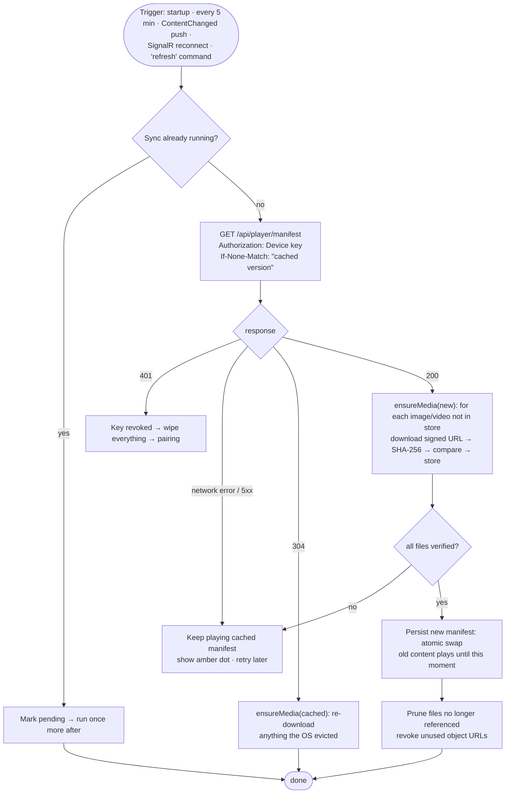

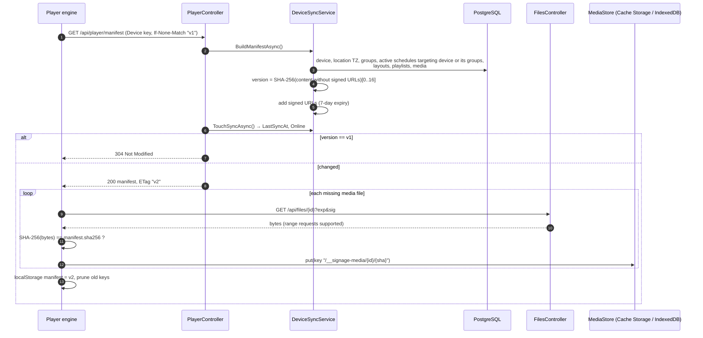

**Manifest contents** (a real sample is in [API §5.12](05-api-reference.md#512-player-device-api)): device (id, name, orientation, time zone), `defaultPlaylistId`, active or future schedules, referenced layouts with zones, referenced playlists with items and effective durations, and media with type, MIME type, sha256, size and a signed URL (or `sourceUrl` for web pages).

## 4.8 Offline playback

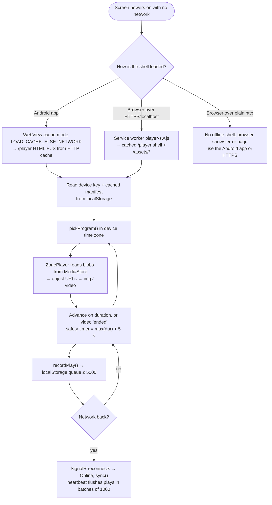

What works offline: images and videos in every layout zone, schedule changes at the right local time, transitions, shuffle, and proof-of-play collection.
What doesn't: `Web` media (iframes need the network), new content, and remote commands.

## 4.9 Device heartbeat and status monitoring

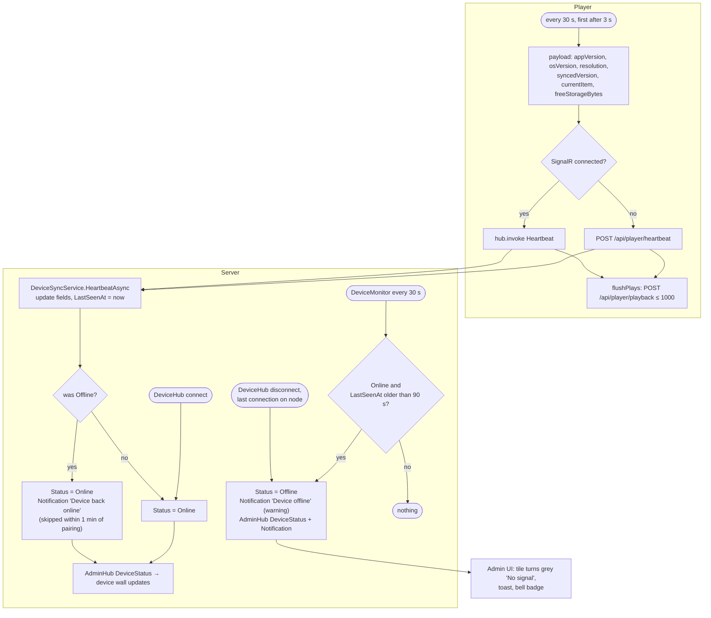

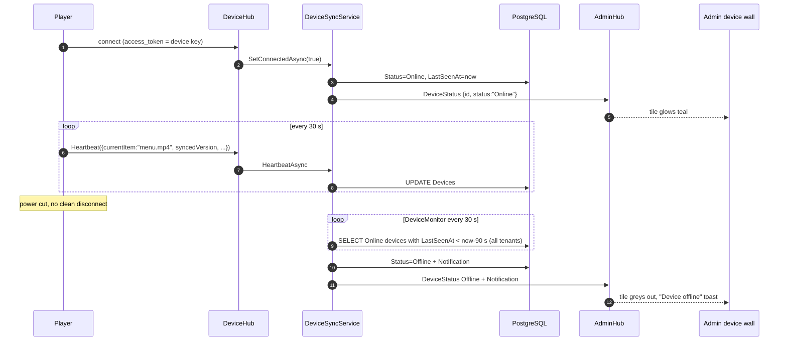

## 4.10 Remote commands

| Command | Button (device page) | Player behaviour |
|---|---|---|
| `identify` | Identify | 10 s full-screen overlay with the device name, organization and content version |
| `refresh` | Sync now | Runs `sync()` immediately |
| `reload` | Restart player | Browser: `location.reload()`. Android: `SignageNative.reload()` (keeps the cache policy) |
| `clear-cache` | API only | Deletes all cached media and the manifest, then syncs from scratch |

Commands are fire-and-forget over SignalR (`202 Accepted`). A screen that is offline at that moment doesn't receive the command later.
