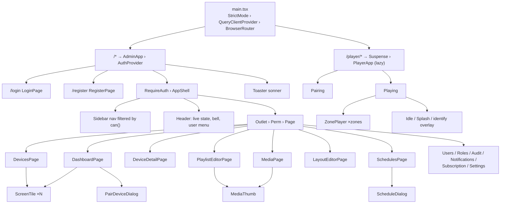
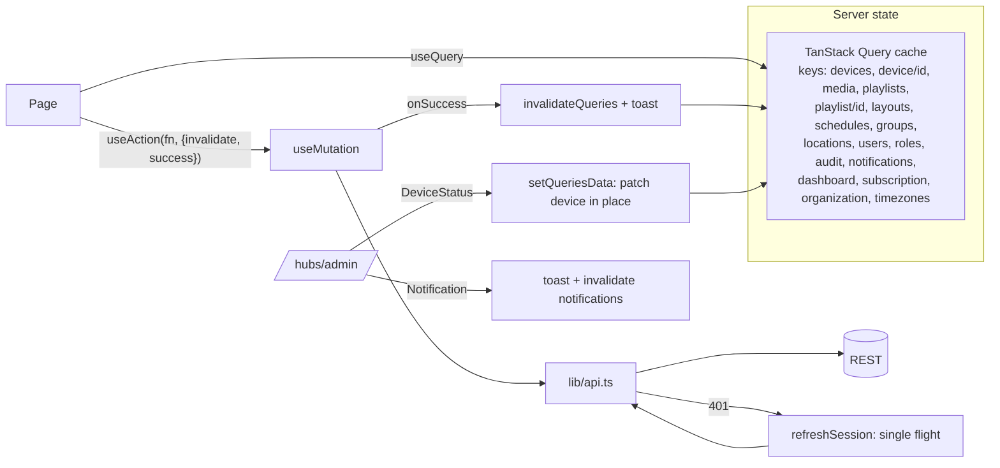

# 6. Frontend architecture

One Vite project produces two applications that share a bundle graph:

| App | Entry | Route | Audience |
|---|---|---|---|
| Admin console | `src/main.tsx` → `AdminApp` | `/*` | Owners, admins, editors, viewers |
| Web player | `src/player/PlayerApp.tsx` (lazy `import()`) | `/player/*` | Screens (browsers and the Android app) |

The player is code-split (~15 KB gzip plus shared React and SignalR), so screens never download admin pages.

## 6.1 Source layout

```text
frontend/
├── index.html                 # root HTML (Figtree font bundled via @fontsource, no CDN)
├── vite.config.ts             # @ alias, dev proxy /api + /hubs → :5080, OUT_DIR for build:api
├── tailwind.config.js         # design tokens mapped to CSS variables
├── public/
│   ├── favicon.svg
│   ├── player-sw.js           # service worker: offline shell for /player (secure contexts)
│   └── downloads/signage-player.apk   # served at /downloads/…
└── src/
    ├── main.tsx               # QueryClient, router, RequireAuth, Perm guard, lazy player
    ├── index.css              # tokens (HSL CSS vars), focus rings, reduced motion
    ├── lib/
    │   ├── api.ts             # fetch wrapper, ApiError, session store, single-flight refresh, XHR upload
    │   ├── auth.tsx           # AuthProvider / useAuth(): user, login, register, logout, can(perm)
    │   ├── realtime.ts        # useAdminRealtime(): /hubs/admin → patches query cache, toasts
    │   ├── types.ts           # DTO types mirroring the API
    │   └── utils.ts           # cn(), formatBytes/Duration, timeAgo, daysLabel
    ├── components/
    │   ├── AppShell.tsx       # sidebar (permission-filtered), header, live indicator, bell, user menu
    │   ├── ScreenTile.tsx     # device-wall tile: screen drawn in its real orientation
    │   ├── common.tsx         # PageHeader, EmptyState, Field, FormError, StatusDot, ConfirmButton, useAction, …
    │   └── ui/                # shadcn/ui primitives (Radix): button, input, label, card, badge,
    │                          #   dialog, dropdown-menu, switch/checkbox, tabs, table
    ├── pages/                 # one file per feature area (see §6.2)
    └── player/
        ├── PlayerApp.tsx      # Pairing, Playing, ZonePlayer, Idle, Splash
        ├── engine.ts          # manifest sync, media cache, schedule evaluation, proof-of-play
        └── store.ts           # MediaStore (Cache Storage | IndexedDB), SHA-256 fallback, native bridge types
```

## 6.2 Routes

| Path | Component (file) | Guard | Purpose |
|---|---|---|---|
| `/login` | `LoginPage` (AuthPages) | public (redirects if signed in) | Email and password sign-in |
| `/register` | `RegisterPage` (AuthPages) | public | Create organization and owner |
| `/` | `DashboardPage` | `dashboard.view` | Stats, device wall, recent activity |
| `/devices` | `DevicesPage` | `devices.view` | Filterable device wall, **Pair a screen** dialog |
| `/devices/:id` | `DeviceDetailPage` | `devices.view` | Settings, commands, device info, proof-of-play, unpair |
| `/groups` | `GroupsPage` (GroupsLocationsPages) | `devices.view` | Group CRUD with member picker and default playlist |
| `/locations` | `LocationsPage` (GroupsLocationsPages) | `locations.view` | Location CRUD with IANA time zones |
| `/media` | `MediaPage` | `media.view` | Grid, drag-drop multi-upload with progress, web pages, edit/delete |
| `/playlists` | `PlaylistsPage` | `playlists.view` | List; “New playlist” creates and opens the editor |
| `/playlists/:id` | `PlaylistEditorPage` | `playlists.view` | Ordered items, durations, transitions, library panel |
| `/layouts` | `LayoutsPage` | `layouts.view` | Your layouts / templates tabs, create from template |
| `/layouts/:id` | `LayoutEditorPage` | `layouts.view` | Drag and resize zone canvas, zone to playlist |
| `/schedules` | `SchedulesPage` | `schedules.view` | Table plus editor dialog (days, times, targets, priority) |
| `/users` | `UsersPage` (AdminPages) | `users.view` | Users, roles, activation, password reset |
| `/roles` | `RolesPage` (AdminPages) | `users.view` | Built-in and custom roles, permission matrix |
| `/audit` | `AuditPage` (AdminPages) | `audit.view` | Paged, searchable audit log |
| `/notifications` | `NotificationsPage` (AdminPages) | signed in | Notification feed, mark read |
| `/subscription` | `SubscriptionPage` (AdminPages) | `subscription.view` | Usage bars, plan switch |
| `/settings` | `SettingsPage` (AdminPages) | signed in | Organization, account, connect-a-screen (APK link) |
| `/player/*` | `PlayerApp` (lazy) | none (device key inside) | Pairing and playback |

Guards: `RequireAuth` redirects to `/login` and preserves the target. `Perm` renders an explanatory empty state instead of the page. Guards are UX only; the API enforces every permission independently.

## 6.3 Component tree



## 6.4 Data flow and state



| Concern | Implementation |
|---|---|
| Server state | TanStack Query. `staleTime` 15 s, refetch on focus, no retry on 4xx |
| Local UI state | `useState` per page or dialog. No global store |
| Session | `localStorage["signage.session"]` (access token, refresh token, expiry), exposed via `onSessionChange` |
| Token refresh | Proactive when expiry is < 30 s away, reactive on 401; single-flight promise because refresh tokens rotate |
| Uploads | `XMLHttpRequest` for upload progress; the browser probes width, height and duration before sending |
| Real-time | One SignalR connection per signed-in tab, reconnects at 0, 2, 5, 10, 30 s. The live/connecting/paused indicator is in the header |
| Forms | Controlled inputs; server field errors mapped with `fieldError(error, "name")`. `Field` links label, control and `aria-describedby` automatically |
| Permissions in UI | `useAuth().can("media.manage")` hides actions; the API is the enforcement point |

## 6.5 Design system

- **Tokens** (HSL CSS variables in `index.css`): background `#F4F6F8`, ink `#18212B`, primary signal teal `#0B7A83`, warning amber, destructive muted red, border and ring. Tailwind maps them (`bg-primary`, `text-muted-foreground`).
- **Type:** Figtree Variable, bundled locally so players boot offline. Tabular numerals globally.
- **Components:** shadcn/ui source copied into `components/ui` (Radix primitives). Native `<select>` styled as `NativeSelect`, because it's accessible and works with TV remotes.
- **Signature element:** `ScreenTile`, each screen drawn as a small display in its real orientation, glowing teal when live.
- **Accessibility:** visible focus rings, labelled controls, `aria-live` on the pairing code, `prefers-reduced-motion` disables animation, and dialogs trap focus (Radix).

## 6.6 Web player internals

| Timer | Interval | Action |
|---|---|---|
| Pairing poll | 3 s (`pollIntervalSeconds`) | `GET /api/pairing/{id}` |
| Sync | startup, 5 min, on `ContentChanged`, on reconnect, on `refresh` | `sync()` ([Workflows §4.7](04-workflows.md#47-content-synchronization)) |
| Schedule evaluation | 15 s and on manifest change | `pickProgram()` ([§4.6](04-workflows.md#46-scheduling)) |
| Heartbeat + proof-of-play flush | 3 s after start, then 30 s | hub `Heartbeat` or REST fallback, then `flushPlays` |
| Identify overlay | 10 s | full-screen device name |

Storage keys: `signage.player.creds` (device key and id), `signage.player.manifest`, `signage.player.plays` (queue, ≤ 5,000), `signage.player.hwid`. Media lives in Cache Storage `signage-media-v1`, or IndexedDB `signage-player/media` on plain HTTP, under keys `/__signage-media/{mediaId}/{sha256}`.

## 6.7 Commands

```bash
cd frontend
npm install
npm run dev          # http://localhost:5173, proxies /api and /hubs to :5080 (VITE_API_PROXY to change)
npm run typecheck    # tsc -b --noEmit
npm run build        # → frontend/dist
npm run build:api    # → backend/src/SignageCms.Api/wwwroot (single-process deployment)
npm run lint
```

| Env var | Default | Purpose |
|---|---|---|
| `VITE_API_URL` | `""` (same origin) | API origin when the UI is hosted on another domain (also set `Cors__AllowedOrigins__0`) |
| `VITE_API_PROXY` | `http://localhost:5080` | Dev-server proxy target |
| `OUT_DIR` | `dist` | Build output directory |

## 6.8 Adding a page

1. Add the DTO type to `lib/types.ts`.
2. Create `pages/ThingPage.tsx`: `useQuery({ queryKey: ["things"], queryFn: () => api<Thing[]>("/api/things") })`, with mutations through `useAction(..., { invalidate: [["things"]], success: "Saved" })`.
3. Register the route in `main.tsx` inside `<Perm p="things.view">`.
4. Add a nav item in `AppShell.tsx` with the same permission.
5. Run `npm run typecheck` and extend `tests/browser_e2e.py`.
