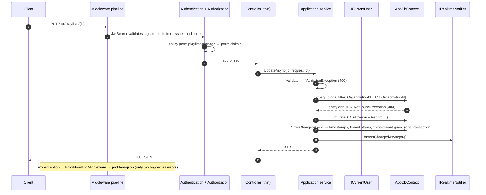

# 7. Backend architecture

.NET 8 solution `backend/SignageCms.sln`, four projects arranged as clean architecture ([Architecture §2.3](02-architecture.md#23-clean-architecture-layers)).

## 7.1 Source layout

```text
backend/
├── SignageCms.sln
├── Directory.Build.props          # net8.0, nullable, implicit usings, warnings
├── NuGet.config                   # nuget.org
├── Dockerfile                     # multi-stage: node build → dotnet publish → aspnet runtime
└── src/
    ├── SignageCms.Domain/
    │   ├── Common/BaseEntity.cs         # BaseEntity (Id, CreatedAt, UpdatedAt), ITenantEntity, TenantEntity
    │   ├── Enums/Enums.cs               # DeviceType, DeviceStatus, Orientation, MediaType, …
    │   └── Entities/                    # Organization, Identity, Devices, Content, Activity
    ├── SignageCms.Application/
    │   ├── Common/
    │   │   ├── Abstractions.cs          # IAppDbContext, ICurrentUser, IPasswordHasher, ITokenService,
    │   │   │                            #   IFileStorage, IUrlSigner, IRealtimeNotifier, IClock
    │   │   ├── Exceptions.cs            # AppException family, Validator, PagedResult
    │   │   ├── Permissions.cs           # 23 permission codes + 4 system roles
    │   │   └── Plans.cs                 # Free / Pro / Enterprise limits
    │   ├── Services/                    # one service per feature (use cases) + DTO records
    │   └── DependencyInjection.cs       # AddApplication()
    ├── SignageCms.Infrastructure/
    │   ├── Persistence/
    │   │   ├── AppDbContext.cs          # tenant filters, enum→text, write guard, timestamps
    │   │   ├── Configurations.cs        # IEntityTypeConfiguration per entity (keys, indexes, FKs, checks)
    │   │   └── DbSeeder.cs              # EnsureCreated, permission catalogue sync, optional demo org
    │   ├── Security/Security.cs         # JwtOptions, JwtTokenService, IdentityPasswordHasher, HmacUrlSigner
    │   ├── Storage/LocalFileStorage.cs  # streaming save + sha256, path-traversal guard
    │   └── DependencyInjection.cs       # AddInfrastructure(config)
    └── SignageCms.Api/
        ├── Program.cs                   # composition root and middleware pipeline
        ├── Controllers/                 # AuthControllers, ScreenControllers, ContentControllers, PlayerControllers
        ├── Hubs/Hubs.cs                 # AdminHub, DeviceHub, SignalRNotifier
        ├── Infrastructure/              # CurrentUser, DeviceAuthentication, Permissions, ErrorHandling, DeviceMonitor
        ├── appsettings*.json
        └── wwwroot/                     # built SPA + player + downloads/signage-player.apk
```

## 7.2 Request lifecycle (low level)



## 7.3 Controllers

Controllers hold no logic: each action is one call into a service. Authorization is declarative.

| File | Controller | Route | Service |
|---|---|---|---|
| AuthControllers.cs | `AuthController` | `/api/auth` | `AuthService` |
| | `UsersController` | `/api/users` | `UserService` |
| | `RolesController` | `/api/roles`, `/api/permissions` | `RoleService` |
| | `OrganizationController` | `/api/organization`, `/api/subscription`, `/api/dashboard`, `/api/timezones` | `OrganizationService` |
| | `NotificationsController` | `/api/notifications` | `NotificationService` |
| | `AuditLogsController` | `/api/audit-logs` | `AuditService` |
| ScreenControllers.cs | `LocationsController` | `/api/locations` | `LocationService` |
| | `DevicesController` | `/api/devices` | `DeviceService` |
| | `DeviceGroupsController` | `/api/device-groups` | `DeviceGroupService` |
| ContentControllers.cs | `MediaController` | `/api/media` | `MediaService` |
| | `FilesController` | `/api/files` (anonymous, signed) | `MediaService.ResolveSignedAsync` |
| | `PlaylistsController` | `/api/playlists` | `PlaylistService` |
| | `LayoutsController` | `/api/layouts` | `LayoutService` |
| | `SchedulesController` | `/api/schedules` | `ScheduleService` |
| PlayerControllers.cs | `PairingController` | `/api/pairing` (anonymous) | `PairingService` |
| | `PlayerController` | `/api/player` (Device scheme) | `DeviceSyncService` |

The complete endpoint list with permissions is in [API §5](05-api-reference.md).

## 7.4 Application services

| Service | Public operations | Notable rules |
|---|---|---|
| `AuthService` | Register, Login, Refresh, Logout, Me | Password policy; global unique email; refresh rotation with reuse detection; login audit |
| `OrganizationProvisioner` | `Provision(name, tz)` | Organization, slug, Free subscription, 4 system roles, 6 templates, in one transaction with the owner |
| `UserService` | List, Get, Create, Update, Delete | Plan `MaxUsers`; at least one active Owner; can't deactivate or delete yourself; password change revokes sessions |
| `RoleService` | List, Create, Update, Delete, AllPermissions | System roles read-only; unique name per organization; 409 when in use |
| `OrganizationService` | Get, Update, Subscription, ChangePlan, Usage, Dashboard | Downgrade blocked by usage (402); time zone change triggers `ContentChanged` |
| `LocationService` | List, Create, Update, Delete | IANA time zone validation; delete detaches devices |
| `DeviceService` | List, Get, Pair, Update, Delete, SendCommand, Playback | Plan `MaxDevices`; key hashing; one-time key hand-off; revoke on delete |
| `DeviceGroupService` | List, Get, Create, Update, Delete | Unique name; membership diffing |
| `PairingService` | Create, Status | Unambiguous 6-char codes; 15-min TTL; poll-secret hash; key returned once |
| `DeviceSyncService` | BuildManifest, TouchSync, Heartbeat, RecordPlayback, SetConnected, SweepStaleDevices | Content-hash version; signed URLs; presence notifications; tolerates unpair races |
| `MediaService` | List, Get, Upload, CreateWeb, Update, Delete, ResolveSigned | Extension allow-list; storage quota; file rollback on DB failure; 409 when in a playlist |
| `PlaylistService` | List, Get, Create, Update, Delete | ≤ 500 items; media must belong to the organization; items fully replaced |
| `LayoutService` | List (layouts or templates), Get, Create, FromTemplate, Update, Delete | Zones within 0–100 %; templates read-only |
| `ScheduleService` | List, Get, Create, Update, Delete | Layout xor playlist; time and day validation; targets must exist |
| `NotificationService` | Add + Publish, List, MarkRead, MarkAllRead | Organization-wide feed (`UserId` null) or per user |
| `AuditService` | Record (queued into the caller's transaction), List (paged) | Captures user, email, IP; never throws separately from the change |

### Data access: why there is no repository layer

Services depend on **`IAppDbContext`** (an Application-layer interface exposing `DbSet<T>` and `SaveChangesAsync`) instead of per-entity repositories. This is deliberate:

- `DbSet<T>` already is a repository and `DbContext` a unit of work. Wrapping them would hide EF features (projections, `Include`, `AsSplitQuery`, `ExecuteUpdateAsync`) behind a lowest-common-denominator API.
- Tenant isolation lives *below* the services, in global query filters and the `SaveChangesAsync` guard. It is enforced even if a query forgets `Where(x => x.OrganizationId == …)`, which a repository layer would otherwise have to guarantee by convention.
- Services stay testable: `AppDbContext` accepts any `DbContextOptions`, so tests can run against a real PostgreSQL (as the E2E suite does) or Testcontainers.

If you need a seam for a different store later, introduce a focused interface for that aggregate (for example `IPlaybackLogStore` for a time-series database) rather than a generic repository.

## 7.5 Middleware and cross-cutting components

| Component | File | Responsibility |
|---|---|---|
| `ErrorHandlingMiddleware` | Infrastructure/ErrorHandling.cs | Maps `ValidationException`→400, `UnauthorizedException`→401, `QuotaExceededException`→402, `ForbiddenException`→403, `NotFoundException`→404, `ConflictException`→409, else 500. Logs only 5xx as errors; client-aborted requests are ignored |
| `DeviceAuthenticationHandler` | Infrastructure/DeviceAuthentication.cs | `Device` scheme: SHA-256(key) lookup, claims `device`, `org` |
| `PermissionPolicyProvider` + `PermissionHandler` + `[HasPermission]` | Infrastructure/Permissions.cs | Dynamic `perm:*` policies on the JWT scheme |
| `HttpCurrentUser` (`ICurrentUser`) | Infrastructure/CurrentUser.cs | User or device id, organization, email, IP from `HttpContext` |
| `DeviceMonitor` (`BackgroundService`) | Infrastructure/DeviceMonitor.cs | Every 30 s: `SweepStaleDevicesAsync` (offline after 90 s), errors logged, never crashes the host |
| `SignalRNotifier` (`IRealtimeNotifier`) | Hubs/Hubs.cs | Maps application events to hub groups |
| Rate limiter | Program.cs | Fixed window per IP: `auth` 20/min, `pairing` 60/min → 429 |
| JWT bearer events | Program.cs | Accepts `?access_token=` on `/hubs/admin` (WebSockets can't send headers) |
| Startup seeding | Program.cs + DbSeeder | Retries 10 × 3 s while PostgreSQL is unreachable |

## 7.6 Persistence details

- **Tenant filters** are built with expression trees for every `ITenantEntity`, comparing against `AppDbContext.CurrentOrganizationId`, which is evaluated per query. Join entities are filtered through their parent.
- **`SaveChangesAsync`** sets `CreatedAt` and `UpdatedAt`, stamps `OrganizationId` on new tenant rows, and throws if a tenant-scoped request writes another organization's rows.
- **Keys** are client-generated GUIDs (`ValueGeneratedNever`), so child entities added through navigations are inserted rather than mistaken for updates.
- **Enums** use a provider CLR type of `string`.
- **Resilience:** `EnableRetryOnFailure(3)` for transient Npgsql errors.
- **Schema:** currently `EnsureCreated()` (see [Deployment §9.4](09-deployment.md#94-database-migrations) for moving to migrations).

## 7.7 Security primitives

| Primitive | Implementation |
|---|---|
| Passwords | ASP.NET Core Identity `PasswordHasher` (PBKDF2-HMAC-SHA512, 100k iterations in .NET 8, v3 format) |
| Access tokens | HS256 JWT, 15 min, 30 s clock skew, issuer and audience validated |
| Refresh tokens | 48 random bytes, base64url, SHA-256 at rest, 14 days, rotation and family revocation |
| Device keys | 32 random bytes, SHA-256 at rest (unique index), returned once |
| Poll secrets | 32 random bytes, SHA-256 at rest, constant-time compare |
| Media URLs | HMAC-SHA256 over `{id}.{exp}`, key = SHA-256("media-url:" + signing key), 128-bit truncated signature, hour-rounded expiry |
| File paths | Storage keys resolved under the root with a traversal check |

## 7.8 Dependency injection

```csharp
builder.Services.AddApplication()                 // services (scoped), IClock (singleton)
                .AddInfrastructure(config);       // DbContext (scoped), JWT/hasher/signer/storage (singletons), DbSeeder
builder.Services.AddScoped<ICurrentUser, HttpCurrentUser>();
builder.Services.AddSingleton<IRealtimeNotifier, SignalRNotifier>();
builder.Services.AddHostedService<DeviceMonitor>();
```

## 7.9 Extending the backend

**Add a feature (e.g. "tickers"):**
1. Domain: add `Ticker : TenantEntity`. It automatically gets the tenant filter and write guard.
2. Infrastructure: add an `IEntityTypeConfiguration<Ticker>` and a `DbSet` on `IAppDbContext` and `AppDbContext`, then a migration.
3. Application: add permission codes to `Permissions.All` (and to system roles), then `TickerService` with a `Validator`, `AuditService.Record`, and `IRealtimeNotifier.ContentChangedAsync` if screens need it.
4. If players need it: extend `DeviceManifest` (additive only, see [API §5.16](05-api-reference.md#516-versioning-and-compatibility)).
5. Api: add `TickersController` with `[HasPermission]` attributes.
6. Tests: extend `tests/e2e.mjs`, including a tenant-isolation case.

**Add a device type:** add a value to `DeviceType` (stored as text, so no data migration), then implement the player protocol ([Players §8.5](08-players.md#85-device-protocol-for-new-device-types)).

## 7.10 Commands

```bash
cd backend
dotnet restore
dotnet build                                   # 0 warnings expected from the solution
cd src/SignageCms.Api
dotnet run                                     # http://0.0.0.0:5080 (launchSettings), Development
ASPNETCORE_ENVIRONMENT=Production Jwt__SigningKey=$(openssl rand -hex 32) dotnet run
dotnet publish -c Release -o ../../out         # framework-dependent publish
```
