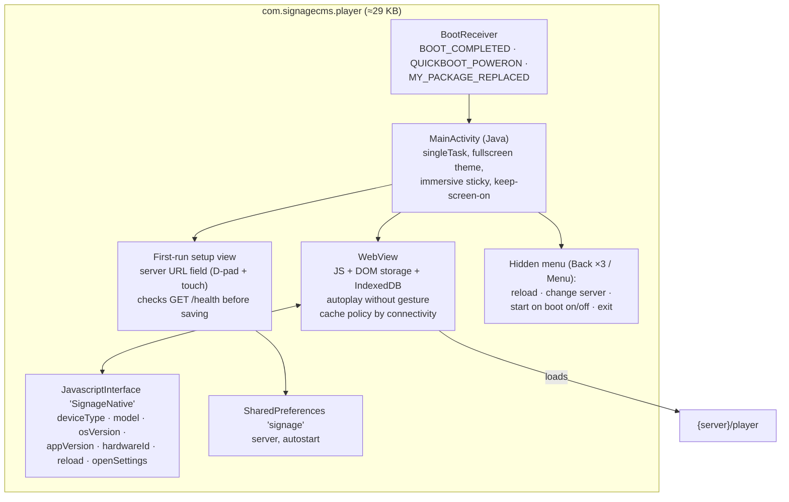
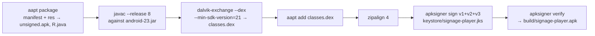
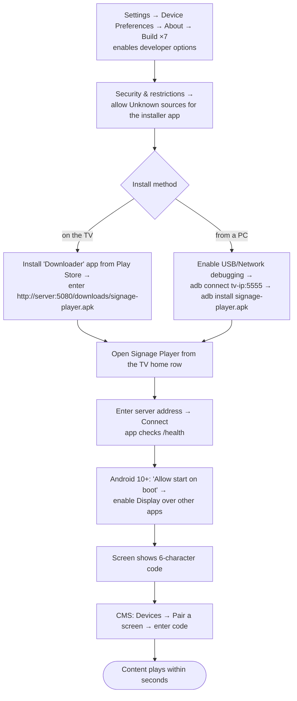
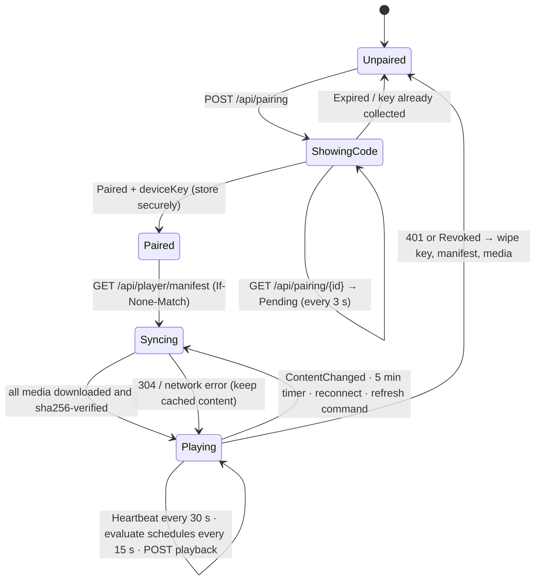

# 8. Players: Android TV, Android tablet, web

All players run the same **web player** (`/player`). Android devices run it inside the **Signage Player** app, a native kiosk shell that adds what a browser can't do on a 24/7 screen.

| | Android TV / Google TV | Android tablet | Web player (browser) |
|---|---|---|---|
| Delivery | `signage-player.apk` (sideload) | same APK | URL `/player` |
| Launcher | Leanback (TV home row, banner) | App drawer | n/a |
| Min OS | Android 5.0 (API 21) | Android 5.0 (API 21) | Chrome/Edge/Firefox/Safari from the last ~3 years |
| Reported `DeviceType` | `AndroidTv` | `AndroidTablet` | `WebPlayer` (or `AndroidTv`/`AndroidTablet` by user agent) |
| Start on boot | yes (Android 10+ needs “Display over other apps”) | yes | configure the OS/kiosk browser |
| Keeps screen awake | `FLAG_KEEP_SCREEN_ON` (also stops the TV screensaver) | same | Wake Lock API where supported |
| Offline boot | WebView HTTP cache (`LOAD_CACHE_ELSE_NETWORK`) | same | service worker (HTTPS or localhost only) |
| Offline media | IndexedDB (plain http) or Cache Storage (https) | same | same |
| Exit protection | Back key captured; hidden menu | same | none |

## 8.1 Android app technology



| Item | Value |
|---|---|
| Language / SDK | Java 8 source, `android-23` platform jar, `minSdkVersion 21`, `targetSdkVersion 23` |
| Dependencies | none (no AndroidX, no Gradle); ~400 lines in 3 classes |
| Permissions | `INTERNET`, `ACCESS_NETWORK_STATE`, `WAKE_LOCK`, `RECEIVE_BOOT_COMPLETED`, `SYSTEM_ALERT_WINDOW` |
| Features | `android.software.leanback` and `android.hardware.touchscreen` both **not required**, so the one APK installs on TVs and tablets |
| Cleartext | `usesCleartextTraffic=true` (LAN servers over `http://`) |
| Signing | APK Signature Scheme v1 + v2 + v3 (`apksigner`) |
| Device type detection | `UiModeManager` = TELEVISION, or has leanback, or has no touchscreen → `AndroidTv`; otherwise `AndroidTablet` |
| Hardware id | `android-` + `Settings.Secure.ANDROID_ID` |
| Reported OS | `"{Manufacturer} {Model} · Android {release}"` |

Source: `android/AndroidManifest.xml`, `android/src/com/signagecms/player/{MainActivity,BootReceiver,Prefs}.java`, `android/res/` (launcher icons, 320×180 TV banner).

## 8.2 Build commands (APK)

Gradle-free build using the Debian/Ubuntu SDK packages:

```bash
sudo apt install android-sdk android-sdk-platform-23 dalvik-exchange openjdk-17-jdk-headless
cd android
./build.sh                                   # → build/signage-player.apk (signed)
cp build/signage-player.apk ../frontend/public/downloads/   # the CMS serves it at /downloads/…
cd ../frontend && npm run build:api           # copy into the API's wwwroot
```

What `build.sh` does:



| Variable | Default | Purpose |
|---|---|---|
| `ANDROID_SDK` | `/usr/lib/android-sdk` | SDK root |
| `KEYSTORE` | `keystore/signage-player.jks` (created on first run) | Signing key |
| `KEYSTORE_PASS` | `signage-player` | Keystore and key password; **change it for production** |

**Releasing an update:** bump `android:versionCode` (integer, must increase) and `versionName` in `AndroidManifest.xml`, bump `VERSION` in `MainActivity.java`, then build with the **same keystore**. Android refuses updates signed with a different key. Back the keystore up somewhere safe. Most changes don't need a new APK at all, because player logic ships with the web app.

**Inspect an APK:** `aapt dump badging build/signage-player.apk` · `apksigner verify -v --print-certs build/signage-player.apk`.

**Google Play:** Play requires a recent `targetSdkVersion`, which this toolchain can't produce. For Play distribution, import `android/` into Android Studio (it is plain Java with no dependencies), set `targetSdk` to the current requirement, and build an AAB.

## 8.3 Installation

**Prerequisite for all screens:** the screen must reach the server. From the device's browser, `http://<server>:<port>/health` must show `Healthy`. The API must bind `0.0.0.0` (the default in `launchSettings.json` and Docker), and the port must be open in the firewall.

### Android TV / Google TV



Menu paths differ by manufacturer (Sony, TCL, Xiaomi, Chromecast with Google TV). Search Settings for “Unknown sources” or “Install unknown apps”.

### Android tablet

1. On the tablet, open `http://<server>:5080/downloads/signage-player.apk` in Chrome, or Settings → Connect a screen → **Download Android app** in the CMS.
2. Allow **Install unknown apps** for Chrome when prompted, then install.
3. Open **Signage Player**, enter the server address, press **Connect**, and on Android 10+ tap **Allow start on boot**.
4. Pair the code in the CMS.
5. For a locked-down kiosk: Settings → Security → **App pinning** (pin Signage Player), or enroll the tablet in an MDM with single-app kiosk mode. Keep it on a charger and set Screen timeout to the maximum.

### adb (bulk or remote installs)

```bash
adb connect 192.168.1.50:5555
adb install -r signage-player.apk            # -r keeps data (pairing) on update
adb shell am start -n com.signagecms.player/.MainActivity
adb shell appops set com.signagecms.player SYSTEM_ALERT_WINDOW allow   # boot start on Android 10+
adb logcat | grep -i -E "signage|chromium"   # WebView console output
```

### On-device controls

| Action | How |
|---|---|
| Hidden menu | Press **Back 3 times** within 2 s, or the **Menu** key |
| Reload player | Menu → Reload player (or CMS: Restart player) |
| Change server | Menu → Change server |
| Stop auto-start | Menu → Turn off start on boot |
| Exit | Menu → Exit |
| Unpair | CMS: device page → Unpair screen. The app returns to a new code |

## 8.4 Web player

Open `https://<server>/player` (or `http://<server>:5080/player`) in any modern browser: smart-TV browsers, Chrome in kiosk mode on a stick PC or Raspberry Pi, and kiosk tablets.

| Topic | Detail |
|---|---|
| Kiosk launch (Chromium) | `chromium --kiosk --autoplay-policy=no-user-gesture-required --noerrdialogs --disable-session-crashed-bubble https://server/player` |
| Fullscreen | Double-click or tap toggles fullscreen when not in kiosk mode |
| Autoplay | Videos are muted, so autoplay works without flags |
| HTTPS vs HTTP | Over HTTPS (or localhost) it uses Cache Storage, WebCrypto and a service worker, so the shell loads offline after a reboot. Over plain `http://<LAN IP>` browsers disable those; the player then uses IndexedDB plus a built-in SHA-256 and keeps playing through outages, **but a full browser restart while offline can't load the page**. Use HTTPS or the Android app for unattended screens |
| Storage | Browsers may evict storage under pressure. The player re-downloads anything missing on the next sync; `freeStorageBytes` appears on the device page |
| Multiple players | One pairing per browser profile (credentials are in `localStorage`). Use separate profiles or devices |

## 8.5 Device protocol (for new device types)

Any client (Tizen, webOS, BrightSign, a native Android rewrite) is a valid player if it implements this contract. Nothing server-side is needed beyond optionally adding a `DeviceType` value.



Minimum implementation checklist:

1. **Pair:** `POST /api/pairing {deviceType, hardwareId, resolution, appVersion, osVersion}`. Display `code`. Poll `GET /api/pairing/{pairingId}` with header `X-Poll-Secret`. Persist `deviceKey` and `deviceId`.
2. **Sync:** `GET /api/player/manifest` with `Authorization: Device <key>` and `If-None-Match: "<version>"`. Download each media `url` (relative to the server; it is pre-signed), verify `sha256`, and only switch to the new manifest when all files are present.
3. **Play:** evaluate schedules in `manifest.device.timeZone` using the rules in [Workflows §4.6](04-workflows.md#46-scheduling) (reference implementation: `pickProgram()` in `frontend/src/player/engine.ts`). Render layout zones as percentage rectangles.
4. **Report:** heartbeat every ≤ 60 s (`POST /api/player/heartbeat` or hub `Heartbeat`), otherwise the device shows Offline after 90 s. Upload plays (`POST /api/player/playback`).
5. **Listen (optional but recommended):** connect `/hubs/device`, handle `ContentChanged`, `Command`, `Revoked`.
6. **Revoke:** on any 401, delete the key and cached content and return to pairing.

## 8.6 Media guidance for screens

| Media | Recommendation |
|---|---|
| Video | H.264 High profile + AAC in MP4, ≤ 1080p30 for low-end TVs (4K only on devices known to decode it), constant frame rate. WebM/VP9 is not reliable on older Android TVs |
| Images | JPEG/WebP at the screen's resolution; PNG only for graphics. Avoid > 8K pixels (WebView memory) |
| Web pages | Must allow framing (no `X-Frame-Options: DENY`). Online only |
| Duration | Image default 10 s. Video plays to the end (a safety timer skips stalled videos after duration + 5 s) |
