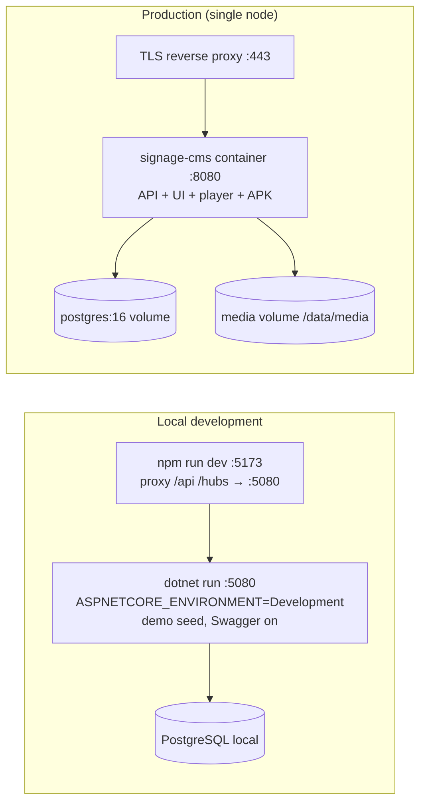
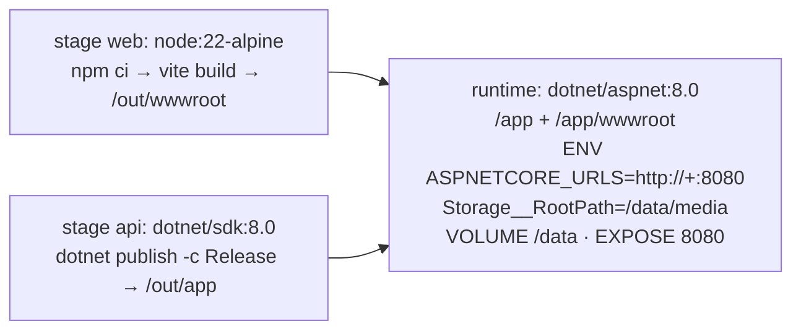

# 9. DevOps and deployment

## 9.1 Environments at a glance



## 9.2 Local environment setup

| Tool | Version | Check |
|---|---|---|
| .NET SDK | 8.0.x | `dotnet --version` |
| Node.js | 20 LTS or 22 | `node -v` |
| PostgreSQL | 14+ (16 recommended) | `psql --version` |
| Python 3 + Playwright | for browser tests only | `python3 -m playwright --version` |
| Android SDK packages | for building the APK only | see [Players §8.2](08-players.md#82-build-commands-apk) |

```bash
# 1. Database
sudo -u postgres psql -c "CREATE USER signage WITH PASSWORD 'signage_dev_pw';"
sudo -u postgres psql -c "CREATE DATABASE signage OWNER signage;"

# 2. API (creates schema + demo org on first start)
cd backend/src/SignageCms.Api
dotnet run          # http://0.0.0.0:5080 · Swagger /swagger · admin@demo.local / Admin@12345

# 3. UI with hot reload
cd frontend && npm install && npm run dev      # http://localhost:5173

# or: single process, like production
cd frontend && npm run build:api               # then http://localhost:5080
```

Helper script `scripts/dev-api.sh`: starts PostgreSQL if stopped, builds, restarts the API in the background (PID in `/tmp/api.pid`, logs in `/tmp/api.log`), and waits for `/health`.

## 9.3 Configuration reference

Settings come from `appsettings.json` → `appsettings.{Environment}.json` → **environment variables** (`__` separates levels) → command line.

| Key (env var) | Required | Default | Notes |
|---|---|---|---|
| `ConnectionStrings__Default` | yes | local dev string | Npgsql format. Add `SSL Mode=Require;Trust Server Certificate=false` for managed databases |
| `Jwt__SigningKey` | **yes** | empty (startup fails) | ≥ 32 bytes of randomness (`openssl rand -hex 32`). Signs JWTs **and** media URLs. Rotating it signs everyone out and invalidates signed URLs (screens get new ones on the next sync) |
| `Jwt__Issuer` / `Jwt__Audience` | no | `signage-cms` | |
| `Jwt__AccessTokenMinutes` | no | `15` | |
| `Storage__RootPath` | no | `storage` (relative to content root) | Docker image: `/data/media`. Must be persistent and backed up |
| `Cors__AllowedOrigins__0..n` | no | none | Only when the UI is served from another origin |
| `Swagger__Enabled` | no | `false` (Development: `true`) | |
| `Seed__AdminEmail` / `Seed__AdminPassword` / `Seed__OrganizationName` / `Seed__TimeZone` | no | empty | Creates the first organization and owner if the email doesn't exist. Remove after first boot |
| `ASPNETCORE_URLS` | no | launchSettings / `http://+:8080` in Docker | |
| `ASPNETCORE_ENVIRONMENT` | no | `Production` | `Development` shows exception details in 500 responses; never use it in production |
| `Logging__LogLevel__Default` | no | `Information` | |

## 9.4 Database migrations

**Current state:** the schema is created by `Database.EnsureCreatedAsync()` in `DbSeeder` on startup. That is fine for a first install, but it **can't evolve an existing database**. Adopt EF migrations before the first production release:

```bash
# one-time setup
dotnet tool install --global dotnet-ef --version 8.0.11
cd backend
dotnet add src/SignageCms.Api package Microsoft.EntityFrameworkCore.Design --version 8.0.11

# create the baseline migration from the current model
dotnet ef migrations add InitialCreate \
  --project src/SignageCms.Infrastructure --startup-project src/SignageCms.Api \
  --output-dir Persistence/Migrations
```

Then, in `DbSeeder.SeedAsync`, replace `await _db.Database.EnsureCreatedAsync(ct);` with `await _db.Database.MigrateAsync(ct);`.

**Databases already created with `EnsureCreated`** need to be told the baseline is applied (run once, before deploying the migration-enabled build):

```sql
CREATE TABLE IF NOT EXISTS "__EFMigrationsHistory" ("MigrationId" varchar(150) PRIMARY KEY, "ProductVersion" varchar(32) NOT NULL);
INSERT INTO "__EFMigrationsHistory" VALUES ('<timestamp>_InitialCreate', '8.0.11');   -- exact id from the generated file name
```

**Everyday workflow**

```bash
dotnet ef migrations add AddTickers --project src/SignageCms.Infrastructure --startup-project src/SignageCms.Api -o Persistence/Migrations
dotnet ef migrations script --idempotent -o migrate.sql ...   # review, or apply in CI
dotnet ef database update ...                                  # local
python3 docs/_tools/gen_db_doc.py                              # regenerate the ERD docs
```

For multi-node deployments, run migrations **once** from a deploy job (idempotent SQL script or `dotnet ef database update`) rather than letting every node call `MigrateAsync` at startup.

## 9.5 Docker

Files: `backend/Dockerfile` (multi-stage), `docker-compose.yml`, `.dockerignore`.



```bash
export JWT_SIGNING_KEY=$(openssl rand -hex 32)
export DB_PASSWORD=$(openssl rand -hex 16)
export SEED_ADMIN_EMAIL=you@example.com SEED_ADMIN_PASSWORD='ChangeMe123' SEED_ORG_NAME='Acme'
docker compose up -d --build
docker compose logs -f api            # wait for "Now listening on: http://[::]:8080"
curl http://localhost:8080/health     # Healthy
```

Compose services: `db` (postgres:16, `pg_isready` health check, volume `pgdata`) and `api` (built image, waits for a healthy db, port 8080, volume `media:/data`).

> ⚠️ The Docker files were written to the same configuration verified locally but were **not executed** in the build environment (no Docker available). Run `docker compose up --build` once in CI or staging before relying on them.

Build and push for a registry:

```bash
docker build -f backend/Dockerfile -t registry.example.com/signage-cms:1.0.0 .
docker push registry.example.com/signage-cms:1.0.0
```

## 9.6 Reverse proxy and HTTPS

Screens and admins should reach the CMS over HTTPS in production. That also gives browser players Cache Storage, WebCrypto and offline-boot service workers. Requirements: WebSocket upgrade for `/hubs/*`, a 1 GB body limit for uploads, long read timeouts for SignalR, and forwarded headers.

```nginx
# /etc/nginx/sites-enabled/signage.conf
map $http_upgrade $connection_upgrade { default upgrade; '' close; }
server {
    listen 443 ssl http2;
    server_name signage.example.com;
    ssl_certificate     /etc/letsencrypt/live/signage.example.com/fullchain.pem;
    ssl_certificate_key /etc/letsencrypt/live/signage.example.com/privkey.pem;

    client_max_body_size 1024m;          # media uploads
    proxy_request_buffering off;         # stream uploads to Kestrel

    location / {
        proxy_pass http://127.0.0.1:8080;
        proxy_http_version 1.1;
        proxy_set_header Host $host;
        proxy_set_header X-Forwarded-For $proxy_add_x_forwarded_for;
        proxy_set_header X-Forwarded-Proto $scheme;
        proxy_set_header Upgrade $http_upgrade;          # SignalR WebSockets
        proxy_set_header Connection $connection_upgrade;
        proxy_read_timeout 120s;                          # > SignalR keep-alive
    }
}
server { listen 80; server_name signage.example.com; return 301 https://$host$request_uri; }
```

Caddy equivalent: `signage.example.com { reverse_proxy 127.0.0.1:8080 }` (WebSockets and headers are automatic; add `request_body { max_size 1GB }`).

> **Required code change behind a proxy that isn't on loopback** (e.g. nginx in another container, or a cloud load balancer): ASP.NET Core only honours `X-Forwarded-*` from `KnownProxies`/`KnownNetworks`, which default to loopback. Without configuring them, every request appears to come from the proxy's IP. The per-IP rate limits then become one shared bucket, and audit logs record the proxy address. In `Program.cs`, configure the options before `UseForwardedHeaders`:
> ```csharp
> builder.Services.Configure<ForwardedHeadersOptions>(o => {
>     o.ForwardedHeaders = ForwardedHeaders.XForwardedFor | ForwardedHeaders.XForwardedProto;
>     o.KnownNetworks.Add(new IPNetwork(IPAddress.Parse("172.16.0.0"), 12)); // your proxy/LB subnet
> });
> // …and call app.UseForwardedHeaders() without inline options.
> ```

**LAN-only installs** (screens on `http://192.168.x.x:5080`) work without a proxy. Open the port (`sudo ufw allow 5080/tcp`, or Windows Defender Firewall → inbound rule TCP 5080).

## 9.7 Running without Docker (systemd)

```bash
cd frontend && npm ci && npm run build:api
cd ../backend && dotnet publish src/SignageCms.Api -c Release -o /opt/signage-cms
sudo useradd --system --home /opt/signage-cms signage && sudo mkdir -p /var/lib/signage/media && sudo chown signage /var/lib/signage/media
```

```ini
# /etc/systemd/system/signage-cms.service
[Unit]
Description=Signage CMS
After=network-online.target postgresql.service
[Service]
User=signage
WorkingDirectory=/opt/signage-cms
ExecStart=/usr/bin/dotnet /opt/signage-cms/SignageCms.Api.dll
Environment=ASPNETCORE_URLS=http://127.0.0.1:8080
Environment=Storage__RootPath=/var/lib/signage/media
EnvironmentFile=/etc/signage-cms.env        # Jwt__SigningKey=…, ConnectionStrings__Default=… (chmod 600)
Restart=always
RestartSec=5
[Install]
WantedBy=multi-user.target
```

`sudo systemctl daemon-reload && sudo systemctl enable --now signage-cms && journalctl -u signage-cms -f`

## 9.8 Operations

**Backups:** both the database and the media directory are required. A database without media gives broken playlists; media without the database is unreferenced files.

```bash
pg_dump -Fc -h db -U signage signage > signage-$(date +%F).dump            # daily, keep 30
tar czf media-$(date +%F).tgz -C /var/lib/signage media                    # or snapshot the volume / object store
# restore
pg_restore -c -d signage signage-2026-09-21.dump && tar xzf media-2026-09-21.tgz -C /var/lib/signage
```

**Retention jobs** (schedule with cron or pg_cron; none run automatically today):

```sql
DELETE FROM "RefreshTokens"   WHERE "ExpiresAt" < now() - interval '1 day';
DELETE FROM "PairingRequests" WHERE "Status" <> 'Pending' AND "CreatedAt" < now() - interval '7 days';
DELETE FROM "Notifications"   WHERE "IsRead" AND "CreatedAt" < now() - interval '30 days';
DELETE FROM "PlaybackLogs"    WHERE "PlayedAt" < now() - interval '90 days';   -- after exporting reports if needed
```

**Monitoring**

| Signal | Source | Alert when |
|---|---|---|
| Liveness | `GET /health` | non-200 for 1 min |
| Errors | logs at `fail:` level (only real 5xx are logged as errors) | any spike |
| Screens offline | `SELECT count(*) FROM "Devices" WHERE "Status"='Offline'` or in-app notifications | fleet-specific threshold |
| Disk | media volume and PostgreSQL volume | > 80 % |
| DB | connections, slow queries (`pg_stat_statements`) | |

`/health` doesn't check the database. Add `AddNpgSql(...)` from `AspNetCore.HealthChecks.NpgSql` if your orchestrator should restart on DB loss.

**Upgrade procedure**
1. Back up the database and media.
2. Apply migrations (once migrations are adopted, §9.4).
3. Deploy the new image or binaries and restart. Screens reconnect automatically (SignalR back-off up to 30 s) and keep playing cached content meanwhile.
4. Only if the Android shell changed: publish the new APK to `frontend/public/downloads/` and reinstall on screens (`adb install -r`). Web-player changes reach every screen on its next page load; use **Restart player** in the CMS to force it.

## 9.9 CI/CD (example pipeline)

A starting point for GitHub Actions. It wasn't executed in the build environment.

```yaml
# .github/workflows/ci.yml
name: ci
on: [push, pull_request]
jobs:
  build-test:
    runs-on: ubuntu-latest
    services:
      postgres:
        image: postgres:16
        env: { POSTGRES_DB: signage, POSTGRES_USER: signage, POSTGRES_PASSWORD: signage_dev_pw }
        ports: ["5432:5432"]
        options: --health-cmd pg_isready --health-interval 5s --health-retries 10
    steps:
      - uses: actions/checkout@v4
      - uses: actions/setup-dotnet@v4
        with: { dotnet-version: "8.0.x" }
      - uses: actions/setup-node@v4
        with: { node-version: "22" }
      - run: cd frontend && npm ci && npm run typecheck && npm run build:api
      - run: cd backend && dotnet build -c Release
      - name: start API
        run: |
          cd backend/src/SignageCms.Api
          ASPNETCORE_ENVIRONMENT=Development nohup dotnet run -c Release --no-build --urls http://0.0.0.0:5080 > api.log 2>&1 &
          for i in $(seq 1 60); do curl -sf localhost:5080/health && break; sleep 2; done
      - run: cd tests && npm ci && node e2e.mjs
      - run: pip install playwright && python -m playwright install --with-deps chromium && cd tests && python browser_e2e.py && python lan_player_test.py
      - if: failure()
        run: cat backend/src/SignageCms.Api/api.log
  android:
    runs-on: ubuntu-latest
    steps:
      - uses: actions/checkout@v4
      - run: sudo apt-get update && sudo apt-get install -y android-sdk android-sdk-platform-23 dalvik-exchange
      - run: cd android && KEYSTORE_PASS=${{ secrets.KEYSTORE_PASS }} ./build.sh   # restore keystore from a secret first
      - uses: actions/upload-artifact@v4
        with: { name: signage-player-apk, path: android/build/signage-player.apk }
```

`lan_player_test.py` targets the machine's LAN IP; set `BASE` via an environment variable, or skip it where the runner has no LAN address.

## 9.10 Production checklist

- [ ] `Jwt__SigningKey` is random, ≥ 32 bytes, and kept in a secret store
- [ ] `ASPNETCORE_ENVIRONMENT=Production`, `Swagger__Enabled=false` (or protected)
- [ ] Seed variables removed after the first owner exists
- [ ] HTTPS reverse proxy with WebSockets, `client_max_body_size 1024m`, forwarded headers **and** `KnownNetworks` configured (§9.6)
- [ ] PostgreSQL has a strong password and TLS; the app user owns only this database
- [ ] Media storage is persistent and included in backups; restore has been tested
- [ ] EF migrations adopted (§9.4)
- [ ] Retention jobs scheduled (§9.8)
- [ ] Android keystore backed up; default keystore password changed
- [ ] Monitoring on `/health`, error logs and disk
