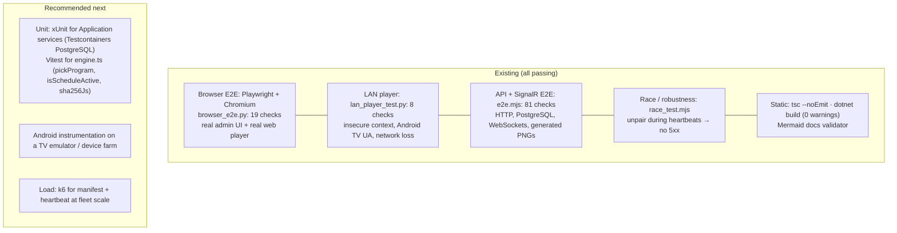

# 10. Testing

## 10.1 Strategy

The system's riskiest behaviour is **integration behaviour**: tenant isolation through EF filters, JWT vs device-key separation, SignalR presence, manifest caching, and offline playback in real browsers. The existing suites therefore test at the outside, against a real API, a real PostgreSQL, real WebSockets and a real Chromium. Unit tests are the recommended next layer for pure logic (§10.6).



## 10.2 Suites and commands

All suites run against a **running API** (`scripts/dev-api.sh`, or `dotnet run` in `backend/src/SignageCms.Api`) with the Development seed (`admin@demo.local` / `Admin@12345`). They create uniquely named data, so they can run repeatedly against the same database.

```bash
# prerequisites (once)
cd tests && npm install                                  # @microsoft/signalr
pip install playwright && python3 -m playwright install chromium

# static checks
cd frontend && npm run typecheck
cd backend && dotnet build

# suites
cd tests
node e2e.mjs                 # API + SignalR           → "81 passed, 0 failed"
python3 browser_e2e.py       # admin UI + web player   → "19 passed, 0 failed"  (screenshots in tests/shots/)
python3 lan_player_test.py   # player over http://<LAN IP>, needs the API bound to 0.0.0.0 → "8 passed, 0 failed"
node race_test.mjs           # unpair-while-heartbeating → "no HTTP 5xx…"
grep -c 'fail:' /tmp/api.log # expect 0 (only genuine 5xx are logged at error level)

# docs
python3 docs/_tools/validate_mermaid.py path/to/mermaid.min.js   # every diagram parses and renders
```

| Env var | Used by | Default |
|---|---|---|
| `API_URL` | e2e.mjs | `http://localhost:5080` |

`browser_e2e.py` targets `http://localhost:5080`. `lan_player_test.py` has the LAN IP baked in when generated; edit `BASE` for your machine.

## 10.3 Coverage matrix

| Area | e2e.mjs (81) | browser_e2e.py (19) | lan_player_test.py (8) |
|---|---|---|---|
| Authentication | wrong password 401; login; permissions in token; `/me`; 401 without token; refresh rotation; reuse rejected; family revoked; registration validation; second org | deep link → login; inline error; sign-in → dashboard | n/a |
| Organization structure | location CRUD; invalid time zone; group create | n/a | n/a |
| Media | PNG upload with server sha256; bad type 400; web media; signed URL bytes match; range 206; tampered sig 403 | upload through UI; browser-probed dimensions stored | n/a |
| Playlists / layouts | playlist with runtime; delete in-use media 409; templates seeded; template read-only; layout from template; zone assignment; zone bounds 400 | playlist editor save; layout from template + zone playlist | n/a |
| Pairing | code format; pending; wrong secret 404; unknown code 400; claim; key once; code single use | code on player → admin pairs | pairs over plain HTTP; `AndroidTv` detected from UA |
| Sync / manifest | bad key 401; JWT on player API 401; default playlist + media; time zone; sha256 download; 304 | plays from local blob; Cache Storage populated | IndexedDB populated, JS SHA-256 verified |
| Real-time | admin hub; device hub; Online pushed; persisted; heartbeat over hub; ContentChanged; version changes; schedule window in manifest; schedule validation; command delivered; proof-of-play | Online on device page; Identify overlay; Offline → Online live | n/a |
| Offline | Offline on disconnect; live notification | reboot with network cut → service worker + cached media | keeps playing with network cut |
| Multi-tenancy | device, media, playlist 404 cross-org; empty lists; foreign media rejected; per-org templates | n/a | n/a |
| RBAC | Viewer read-only; add user; viewer can list; upload/delete/audit 403; built-in roles immutable; custom role | n/a | n/a |
| Subscription | Free limits; pair to limit; 402 over limit; only owner changes plan; upgrade; pair after upgrade | n/a | n/a |
| Unpair / audit / notifications | Revoked pushed; revoked key 401; audit actions recorded; notifications; read-all; dashboard | unpair wipes player → new code; no JS errors | unpair wipes IndexedDB |

## 10.4 What a failing run tells you

| Symptom | Likely cause |
|---|---|
| Everything fails with `ECONNREFUSED` | API not running, or bound to another port |
| Auth section passes, SignalR hangs | Proxy or WebSocket issue; test against Kestrel directly |
| `Free plan: …` limit checks fail | The test org isn't on Free. The suite uses a freshly registered org, so check that registration succeeded |
| Browser suite times out on `Live` | `/hubs/admin` blocked, or the JWT isn't accepted via `access_token` |
| LAN suite: `running in an insecure context` fails | You pointed it at `localhost`; it must use the machine's LAN IP |
| `fail:` lines in the API log | A real server error. Search by `traceId` from the failing response |

## 10.5 Manual acceptance checklist (real hardware)

Run on at least one Android TV and one tablet before rollout. These can't be automated in CI without a device farm.

- [ ] APK installs (sideload and `adb install`); TV shows the banner in the home row
- [ ] Setup rejects a wrong address with a clear message; accepts `ip:port`
- [ ] Pairing code is legible from 3 m; pairing completes in < 10 s
- [ ] 1080p H.264 video plays smoothly and loops; images transition with fade/slide
- [ ] Multi-zone layout renders proportionally in landscape and portrait
- [ ] Unplug the network cable: content continues; admin shows Offline within ~90 s
- [ ] Power-cycle with the network down: the app starts on boot (Android 10+: overlay permission granted) and plays cached content
- [ ] Reconnect: Online returns; proof-of-play from the offline period appears on the device page
- [ ] Schedule with a window starting 2 minutes from now switches content at the right local time, including offline
- [ ] Identify, Sync now, Restart player all work; Back ×3 opens the menu
- [ ] Unpair from the CMS: the screen returns to a new code within seconds
- [ ] 24-hour soak: no memory growth or black screens (check `adb shell dumpsys meminfo com.signagecms.player`)

## 10.6 Recommended additions

| Layer | Tooling | First targets |
|---|---|---|
| Backend unit/integration | xUnit + FluentAssertions + **Testcontainers.PostgreSql** (real Postgres, since filters are provider-specific) + `WebApplicationFactory<Program>` (`public partial class Program` already exists) | Tenant write guard; `ScheduleService` validation; refresh-token reuse; manifest version stability; plan limits |
| Player unit | Vitest (Vite-native) | `isScheduleActive` edge cases (overnight across month/year ends, DST days in `Europe/London`/`America/New_York`), `pickProgram` priority, `sha256Js` vectors, `Prefs.normalize` equivalents |
| Frontend components | Vitest + Testing Library | `Field` accessibility wiring; `useAction` invalidation; permission gating |
| Contract | Snapshot `docs/api/openapi.json` in CI and fail on removed player fields ([API §5.16](05-api-reference.md#516-versioning-and-compatibility)) | `/api/player/*`, `/api/pairing/*` |
| Load | k6 | 1,000 simulated screens: heartbeat every 30 s + manifest `If-None-Match` every 5 min; one `ContentChanged` fan-out |
| Security | OWASP ZAP baseline against staging; `dotnet list package --vulnerable`; `npm audit` | Auth endpoints, file endpoint, upload |
