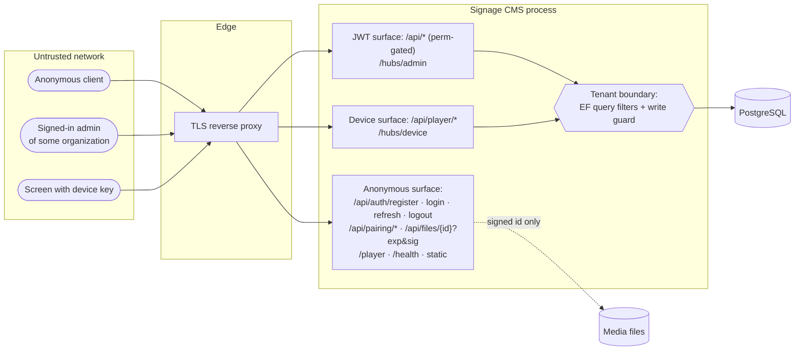

# 11. Security

## 11.1 Trust boundaries

The most important invariant is that **no request can read or write another organization's data**. It is enforced below the services (global query filters and a `SaveChangesAsync` guard), so a forgotten `Where` clause in new code doesn't open a hole. Six tests exercise it directly ([Testing §10.3](10-testing.md#103-coverage-matrix)).

## 11.2 Controls in place

| Threat | Control | Where |
|---|---|---|
| Cross-tenant access | Global query filters on every tenant entity; join tables filtered via parent; cross-tenant writes throw; foreign ids return 404 | `AppDbContext` |
| Privilege escalation | 23 fine-grained permissions in the JWT; `[HasPermission]` on every admin action; built-in roles immutable; last active Owner protected | `Permissions.cs`, `RoleService`, `UserService` |
| Credential theft (passwords) | PBKDF2 (Identity v3, HMAC-SHA512, 100k iterations); the same error for unknown email and wrong password | `IdentityPasswordHasher`, `AuthService` |
| Token theft | 15-min access tokens; refresh tokens hashed at rest, rotated, and reuse revokes the whole family; logout revokes; deactivation or password change revokes all sessions | `AuthService`, `UserService` |
| Device impersonation | 256-bit random device keys, SHA-256 at rest (unique index), shown exactly once, revoked on unpair (immediate 401 + `Revoked` push) | `DeviceService`, `PairingService` |
| Pairing interception | Poll secret (256-bit, hashed, constant-time compare) required to collect the key; codes expire in 15 min and are single use | `PairingService` |
| Scheme confusion | Permission policies bind to the JWT scheme only; player endpoints to the Device scheme only (both tested) | `PermissionPolicyProvider`, controllers |
| Media hot-linking | Files served only via HMAC-signed, expiring URLs; tampering → 403 | `HmacUrlSigner`, `FilesController` |
| Path traversal | Storage keys are server-generated; resolved paths must stay under the root | `LocalFileStorage` |
| Malicious uploads | Extension allow-list (no SVG, HTML or executables); size cap 1 GB; storage quota | `MediaService`, Kestrel |
| Brute force | `auth` limit 20/min/IP, `pairing` 60/min/IP | `Program.cs` |
| Injection | EF Core parameterized queries only; no raw SQL | everywhere |
| XSS (admin UI) | React escaping; no `dangerouslySetInnerHTML`; SVG uploads disallowed | frontend |
| Information leakage | Stack traces only in Development; problem+json with `traceId`; Swagger off by default outside Development | `ErrorHandlingMiddleware`, `appsettings.json` |
| Accountability | Audit log for every mutation, with user, email and IP (written in the same transaction) | `AuditService` |
| Misconfiguration | API refuses to start without a ≥ 32-byte signing key | `Program.cs` |

## 11.3 Findings and recommended fixes

Found by reviewing the current code. None are exploitable across tenants, but fix the **High** items before production.

| # | Severity | Finding | Fix |
|---|---|---|---|
| S1 | **High** | `POST /api/devices/pair` has **no rate limit**. Anyone can register a free organization and brute-force 6-character codes (32⁶ ≈ 1.07 × 10⁹) to claim a screen that is currently showing a pairing code, then play their own content on it. The odds grow with the number of screens pairing at once. | Add `[EnableRateLimiting]` with a per-user limit (e.g. 10/min keyed by `sub`) and a global circuit breaker on failed claims. Consider 8-character codes. |
| S2 | **High** | Behind a proxy not on loopback, `UseForwardedHeaders` ignores `X-Forwarded-For` (no `KnownNetworks`), so per-IP rate limits and audit IPs use the proxy's address. | Configure `ForwardedHeadersOptions.KnownNetworks/KnownProxies` ([Deployment §9.6](09-deployment.md#96-reverse-proxy-and-https)). |
| S3 | **High** (LAN installs) | Over plain `http://`, JWTs, refresh tokens and device keys cross the network in clear text. | Terminate TLS (a reverse proxy with an internal CA, or a public domain with Let's Encrypt). The players and Android app work unchanged over HTTPS. |
| S4 | Medium | No security response headers (CSP, HSTS, `X-Content-Type-Options`, `Referrer-Policy`, `frame-ancestors`). Access tokens live in `localStorage`, so any future XSS could read them. | Add headers at the proxy or in middleware. Start with CSP `default-src 'self'; img-src 'self' blob: data:; media-src 'self' blob:; connect-src 'self' ws: wss:; frame-src https:; object-src 'none'; frame-ancestors 'none'` (the player needs `frame-src` for Web media). |
| S5 | Medium | Web media renders in `<iframe sandbox="allow-scripts allow-same-origin">`. If an editor adds a URL on the **CMS's own origin**, that page could read the player's `localStorage` (device key). The impact is limited to the editor's own organization's screens. | Reject Web media whose origin equals the CMS origin, or drop `allow-same-origin` (some sites will break), or host the player on a separate origin. |
| S6 | Medium | Uploads are validated by extension only; the file's magic bytes aren't checked, and responses lack `X-Content-Type-Options: nosniff`. | Sniff magic bytes (JPEG, PNG, GIF, WebP, MP4, WebM signatures) and add `nosniff` on `/api/files`. Optionally transcode or re-encode media. |
| S7 | Medium | Login timing differs between an unknown email (no hash computed) and a wrong password, which allows account enumeration by timing. Registration returns 409 for existing emails (an inherent product trade-off). | Verify against a dummy hash when the user isn't found. Consider an email-verification flow for registration. |
| S8 | Low | Signed media URLs are bearer URLs (6 h in the admin UI, 7 days in manifests). A leaked URL exposes that one file until it expires. | Acceptable for signage content. Shorten manifest URL lifetime if content is sensitive (players re-sync every 5 min). |
| S9 | Low | Device keys are stored unencrypted in the browser's or WebView's `localStorage` on the screen. | Physical access to a screen already implies control of it. For the Android app, move the key to `EncryptedSharedPreferences` (needs AndroidX) and pass it through the bridge. |
| S10 | Low | No MFA, password reset or email verification; admins set initial passwords. | Add email flows (reset and invite links) and TOTP MFA for Owner and Admin roles. |
| S11 | Low | Audit logs can be edited by anyone with database access. | Ship logs to append-only storage (SIEM), or use a trigger that blocks `UPDATE`/`DELETE` on `AuditLogs`. |
| S12 | Info | Subscription plan changes are self-service with no payment integration. | Put `PUT /api/subscription` behind a billing provider webhook before selling plans. |
| S13 | Info | Android app targets API 23 with `usesCleartextTraffic=true`. | Once served over HTTPS, set a network security config restricting cleartext to your LAN range, or disable it. |

## 11.4 Secrets inventory

| Secret | Where it lives | Rotation impact |
|---|---|---|
| `Jwt__SigningKey` | env or secret store | All users signed out; all signed media URLs invalid until screens re-sync (≤ 5 min, or instantly via **Sync now**) |
| DB password | env / connection string | Restart the API |
| Android keystore + password | `android/keystore/` (keep **out of git** and back it up) | Losing it means screens must uninstall and reinstall to update |
| Device keys | device storage; SHA-256 in DB | Unpair and re-pair the device |
| Refresh tokens | client storage; SHA-256 in DB | Revoked on logout, password change, deactivation or reuse |

## 11.5 Hardening checklist

- [ ] S1–S3 fixed; HTTPS everywhere
- [ ] Security headers (S4) set at the proxy
- [ ] `ASPNETCORE_ENVIRONMENT=Production`, Swagger off or behind auth
- [ ] Database not reachable from the internet; least-privilege DB user
- [ ] Media volume not web-served directly (only via `/api/files`)
- [ ] Backups encrypted; restore tested
- [ ] `dotnet list package --vulnerable` and `npm audit` clean in CI
- [ ] Log retention and alerting on 5xx and auth failure spikes
- [ ] Android: keystore secured; APK distributed only from your server or MDM

## 11.6 Reporting and review

Treat changes to these files as security-sensitive and require review: `AppDbContext.cs` (filters and guard), `Permissions.cs`, `DeviceAuthentication.cs`, `Security.cs`, `AuthService.cs`, `PairingService.cs`, `DeviceService.PairAsync`, `FilesController`, `Program.cs` (auth, CORS, rate limits, headers).
