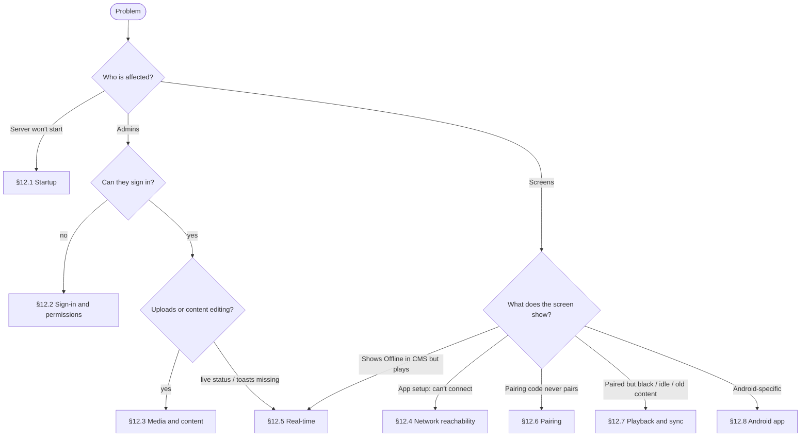

# 12. Troubleshooting

Start with the triage flow, then jump to the matching table. Every API error response carries a `traceId`; search the server log for it.



## 12.1 Startup

| Symptom | Cause | Fix |
|---|---|---|
| `Jwt:SigningKey must be at least 32 bytes` | Missing or short key (production has none by default) | `export Jwt__SigningKey=$(openssl rand -hex 32)` |
| `Database not reachable (attempt n/10)… ` then exit | PostgreSQL down, wrong host or credentials | Check `ConnectionStrings__Default`; `pg_isready -h <host>`; start the DB. The API retries for 30 s |
| `ConnectionStrings:Default is not configured` | Missing setting | Set `ConnectionStrings__Default` |
| `address already in use :5080` | Another instance running | `lsof -i :5080`, stop it (`kill $(cat /tmp/api.pid)` with `dev-api.sh`) |
| Page shows the “Build the frontend into wwwroot” placeholder | UI not built into the API | `cd frontend && npm run build:api` |
| Schema errors after pulling new code (`column … does not exist`) | `EnsureCreated` doesn't update existing databases | Adopt migrations ([Deployment §9.4](09-deployment.md#94-database-migrations)); in dev, drop and recreate the DB |

## 12.2 Sign-in and permissions

| Symptom | Cause | Fix |
|---|---|---|
| “Email or password is incorrect” for the demo account | Not in Development, so the demo seed didn't run | Use `Seed__AdminEmail`/`Seed__AdminPassword`, or register |
| “This account is disabled” | User deactivated, or organization inactive | An owner reactivates the user in Users |
| Signed out repeatedly | Refresh token reused (two tabs refreshing with an old token → family revoked), or the signing key rotated | Sign in again. A rotated key signs everyone out by design |
| 429 on login | 20 auth requests/min/IP | Wait a minute. Behind a proxy, all users may share one IP: configure `KnownNetworks` ([Security S2](11-security.md#113-findings-and-recommended-fixes)) |
| A page shows “You don't have access” / API 403 | Role lacks the permission | Owner/Admin adds it to a custom role. The token picks it up on refresh (≤ 15 min) or on sign-in |
| Can't remove or demote a user | They're the last active Owner | Make someone else Owner first |

## 12.3 Media and content

| Symptom | Cause | Fix |
|---|---|---|
| Upload fails at 100 % with 413 | File > 1 GB, or proxy `client_max_body_size` too small | Raise the nginx limit to `1024m`; compress the video |
| 400 “files aren't supported” | Extension not allowed | Use jpg, jpeg, png, gif, webp, mp4, webm or m4v |
| 402 on upload / pairing / adding users | Plan limit | Plan and usage → upgrade, or delete unused items |
| 409 deleting media, playlist or layout | Still in use (playlist or schedule) | The message names what uses it; remove it there first |
| Thumbnails broken in the admin UI | Signed URL expired (6 h) on a long-open tab, or the file is missing on disk | Refresh the page; check `Storage__RootPath` points at the persistent volume |
| Web page media is blank | Site forbids framing (`X-Frame-Options`/CSP) | Use a page that allows embedding, or a screenshot |
| Layout save 400 `zones[i]` | Zone extends past 100 % | Adjust X/Y/W/H; the editor clamps drags, but typed values aren't clamped |

## 12.4 Network reachability (screens)

| Symptom | Cause | Fix |
|---|---|---|
| App: “Can't reach the server…” | Server bound to `localhost`, firewall, or different network or VLAN | Run with `--urls http://0.0.0.0:5080` (the default in launchSettings and Docker); open the port; test `http://<server>:5080/health` in the TV's browser |
| App: “Unknown host” | DNS name not resolvable on the LAN | Use the IP, or add local DNS |
| App: “server answered HTTP 404” | Wrong port or path (another service) | Use the CMS base address only, without `/player` |
| Works on Wi-Fi, fails on guest Wi-Fi | Client isolation | Put screens on a network that can reach the server |

## 12.5 Real-time (live status, toasts, instant updates)

| Symptom | Cause | Fix |
|---|---|---|
| Header shows “Updates paused” / “Connecting” | WebSocket blocked at the proxy | nginx: `proxy_set_header Upgrade $http_upgrade; Connection $connection_upgrade; proxy_http_version 1.1` ([Deployment §9.6](09-deployment.md#96-reverse-proxy-and-https)) |
| Screens update only every ~5 minutes | Device hub not connected (they rely on the periodic sync) | Same proxy fix; check that `/hubs/device` isn't blocked |
| Device flips Offline→Online every ~90 s | Heartbeats not arriving (REST blocked, or the clock is badly wrong) | Check proxy logs for `/api/player/heartbeat`; the device page's “Last seen” should update every 30 s |
| Multi-node: some admins don't see status changes | No SignalR backplane | Add the Redis backplane ([Architecture §2.8](02-architecture.md#28-deployment-topology-and-scaling)) |

## 12.6 Pairing

| Symptom | Cause | Fix |
|---|---|---|
| “That code is invalid or has expired” | Typo (codes never contain 0/O/1/I), expired (15 min), or already claimed | Re-check the screen; the code refreshes automatically when expired |
| Screen stays on the code after the admin paired it | Screen can't reach `/api/pairing/{id}` (network), or 429 from many screens behind one NAT | Check connectivity; pairing limit is 60/min/IP. Large NAT'd fleets should raise it |
| Screen shows “Too many attempts. Retrying shortly.” | Pairing rate limit hit | Wait; stagger first boots |
| Paired device shows the wrong type | Browser UA didn't identify as Android TV | Use the Android app (native detection), or accept `WebPlayer`. Type is informational |

## 12.7 Playback and sync

| Symptom | Cause | Fix |
|---|---|---|
| Screen shows the clock with “nothing scheduled right now” | No active schedule and no default playlist (device or group) | Set a default playlist on the device or its group, or check the schedule days, times and time zone |
| Content changes at the wrong hour | Location time zone wrong, or device not assigned a location (uses the organization default) | Fix the location's time zone; check the device's location |
| “Preparing content…” forever on first boot | A media download or checksum failed (large video on a slow link, storage full) | The device page shows `Free storage`; use **Sync now**. Browser console: `Checksum mismatch` means the file changed on disk; re-upload it |
| Old content keeps playing after edits | Sync failing (amber dot at bottom-left = offline); new media still downloading (progress bottom-right) | Wait for the download; check connectivity; **Sync now** |
| Video skipped after a few seconds, or black | Codec unsupported by the device (VP9/HEVC on older TVs) | Re-encode to H.264/AAC MP4 ([Players §8.6](08-players.md#86-media-guidance-for-screens)) |
| Browser player blank after a reboot without network | Plain `http://` origin: no service worker allowed | Use the Android app or serve over HTTPS |
| Proof-of-play missing | Plays upload with heartbeats; offline periods upload on reconnect (queue ≤ 5,000) | Wait for reconnect; very long outages drop the oldest plays beyond 5,000 |
| Stuck after a big change | Corrupt local cache (rare) | `POST /api/devices/{id}/commands {"command":"clear-cache"}` |

## 12.8 Android app

| Symptom | Cause | Fix |
|---|---|---|
| “App not installed” | Older version signed with a different key, or a downgrade | Uninstall the old app first (it will need re-pairing); always sign with the same keystore |
| Play Protect warning | Sideloaded app with an old target SDK | “Install anyway”, or distribute via MDM |
| App doesn't start after reboot (Android 10+) | “Display over other apps” not granted | Setup screen → **Allow start on boot**, or `adb shell appops set com.signagecms.player SYSTEM_ALERT_WINDOW allow` |
| TV turns itself off overnight | TV power-saving or eco timer (outside the app's control) | Disable auto power-off in the TV's settings; use HDMI-CEC or scheduling features if available |
| Can't leave the player | Kiosk behaviour: Back is captured | Press Back 3 times quickly (or Menu) → Exit |
| No app icon on the TV home row | Launcher cache | Reboot the TV; the app is also listed in Settings → Apps |
| Need WebView logs | n/a | `adb logcat \| grep -i -E "chromium\|console"`. For DevTools via `chrome://inspect`, build a debug variant that calls `WebView.setWebContentsDebuggingEnabled(true)`; the release APK doesn't enable it |

## 12.9 Useful diagnostics

```bash
curl -s http://server:5080/health                                            # Healthy
curl -s -o /dev/null -w '%{http_code}\n' http://server:5080/player           # 200
curl -s -D- http://server:5080/api/player/manifest -H "Authorization: Device <key>" -o /dev/null   # 200 + ETag, or 401 revoked
psql -c 'SELECT "Name","Status","LastSeenAt","SyncedVersion","CurrentItem" FROM "Devices" ORDER BY "LastSeenAt" DESC NULLS LAST;'
psql -c 'SELECT "CreatedAt","UserEmail","Action","Summary" FROM "AuditLogs" ORDER BY "CreatedAt" DESC LIMIT 20;'
grep -E 'fail:|traceId' /tmp/api.log                                         # server errors
```

Browser player: DevTools → Application → Local Storage (`signage.player.*`), Cache Storage `signage-media-v1`, or IndexedDB `signage-player`.
