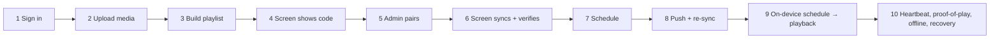
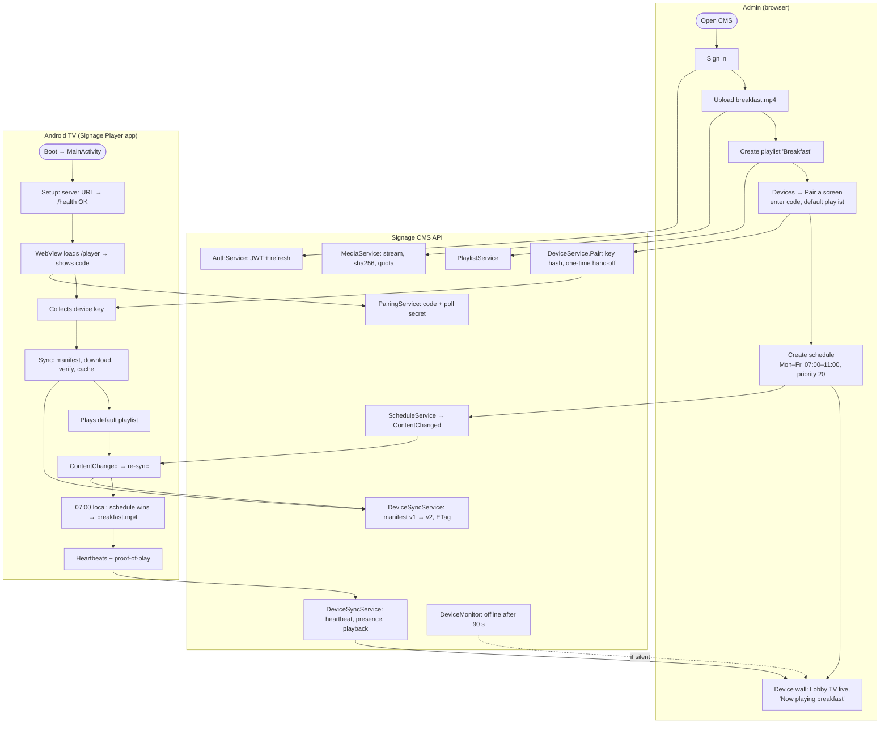
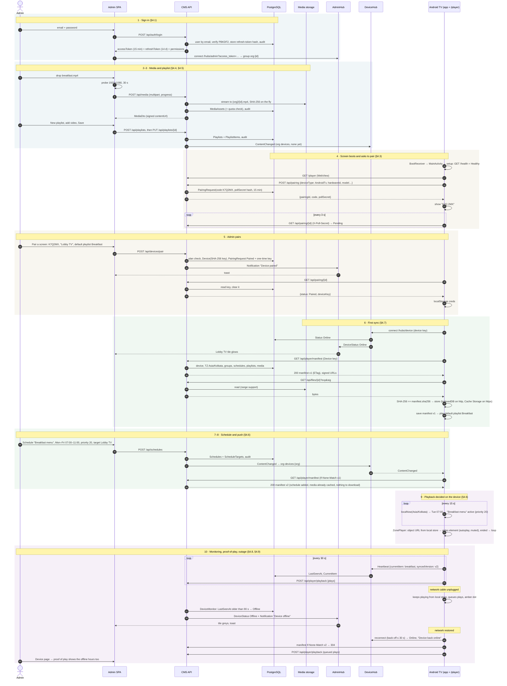

# 13. End-to-end flow: admin login to content on screen

This walks through one realistic journey across every component: an admin signs in, uploads a video, builds a playlist, pairs a new Android TV, and schedules a breakfast menu. The TV then plays it, including through a network outage. Each step references the detailed workflow.

## 13.1 Journey overview

## 13.2 Swimlane view

## 13.3 Complete sequence

## 13.4 Timing budget (typical LAN)

| Step | Typical time | Governed by |
|---|---|---|
| Code appears on a fresh screen | < 2 s after page load | `POST /api/pairing` |
| Screen reacts after admin pairs | ≤ 3 s | pairing poll interval |
| First content visible | download time of the playlist's files + ~1 s | network, file sizes |
| Admin edit reaches screens | < 1 s push + conditional GET + any new downloads | SignalR `ContentChanged` |
| Schedule boundary to switch | ≤ 15 s | evaluation interval |
| Status shows Offline after power loss | 90–120 s | 90 s threshold + 30 s sweep |
| Offline after clean disconnect (network drop detected by the socket) | seconds to ~30 s | SignalR keep-alive |
| Status Online after recovery | ≤ 30 s | reconnect back-off |
